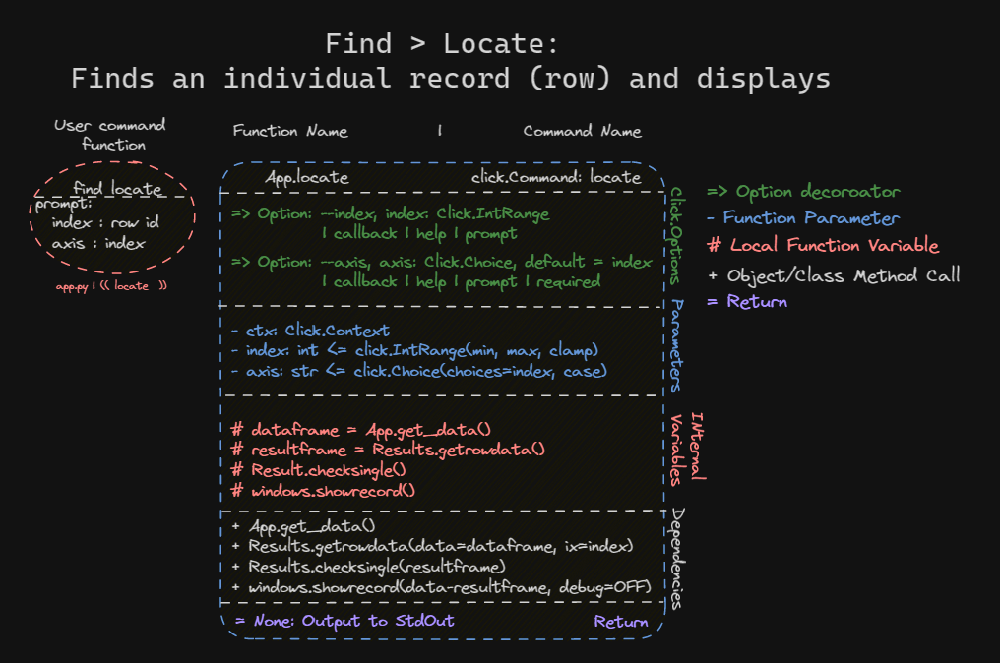
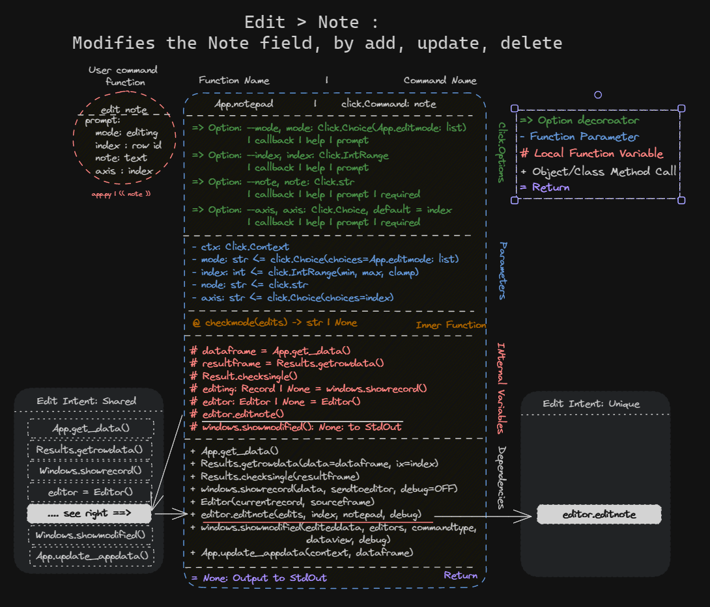
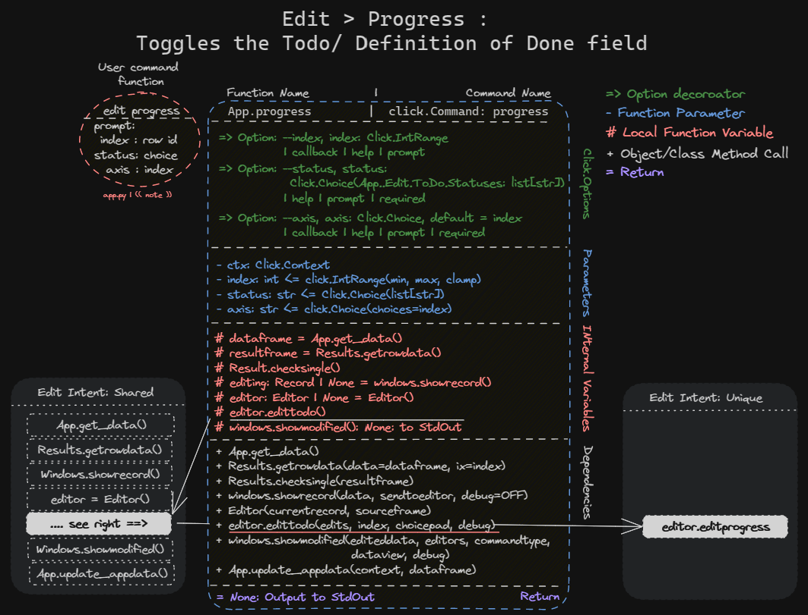
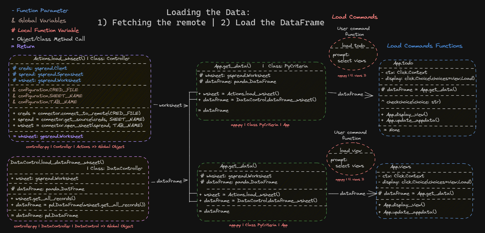
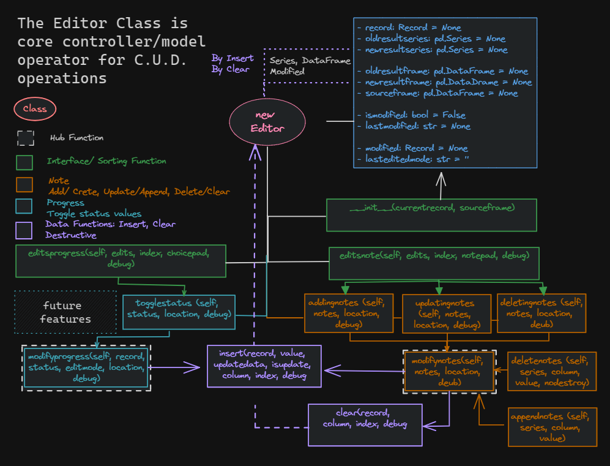

<!-- markdownlint-disable -->
# Code & Logic Design 

## Flowchart

## Commands

- File: `app.py`
- Arcitecture: Nested (grouped) command structure
- Runs in own REPL: `register_repl(cli)`

| File     | Figure | Command    | Parent | Role                                                                                                       | Option    | Help  | Prompt   Value Entry | Single Line  Flags   Value Entry  i.e `--option` | Help   `--help`, `-h`              |
| :------- | :----- | :--------- | :----- | :--------------------------------------------------------------------------------------------------------- | :-------- | :---- | :---------------------- | :----------------------------------------------------- | :------------------------------------ |
| `app.py` | `---`  | `run`      | None   | **Base**   Anchors nested commands                                                                      | `---`     | `---` | No                      | No                                                     | Yes, on `enter` or `--help`, `-h`     |
| `app.py` | `---`  | `clear`    | Run    | **Action**  Clears the click REPL stdout                                                                | `---`     | `---` | No                      | Just command & `enter`                                 | Yes, on `enter` or `--help`, `-h`     |
| `app.py` | `---`  | `load`     | Run    | **Intent**  Displays the Load Mode Guide                                                                | `---`     | `---` | No                      | No Action                                              | Yes, on `enter` or `--help`, `-h`     |
| `app.py` | `---`  | `todo`     | Load   | **Action**  Display preselected sub views of the datasource spreadsheet for ToDo tasks                  | `---`     | `---` | **Yes**                 | Yes, see `--help`                                      | Only on `--help`, else `enter` prompt |
| `app.py` | `---`  | `views`    | Load   | **Action**  Display preselected sub views of the datasource spreadsheet for Assignments meta data       | `---`     | `---` | **Yes**                 | Yes, see `--help`                                      | Only on `--help`, else `enter` prompt |
| `app.py` | `---`  | `find`     | Run    | **Intent**  Displays the Find Mode Guide                                                                | `---`     | `---` | No                      | No Action                                              | Yes, on `enter` or `--help`, `-h`     |
| `app.py` | `---`  | `locate`   | Find   | **Action**  Finds a single row/record by a row id/number/index                                          | `---`     | `---` | **Yes**                 | Yes, see `--help`                                      | Only on `--help`, else `enter` prompt |
| `app.py` | `---`  | `edit`     | Run    | **Intent**  Displays the Edit Mode Guide                                                                | `---`     | `---` | No                      | No Action                                              | Yes, on `enter` or `--help`, `-h`     |
| `app.py` | `---`  | `note`     | Edit   | **Action**  Modifies the note fields   Add => Insert Note   Update => Append   Delete -> Clear | see below | `---` | **Yes**                 | Yes, see `--help`                                      | Only on `--help`, else `enter` prompt |
| `app.py` | `---`  | `progress` | Edit   | **Action**  Toggles the status of progress and DoD fields                                               | see below | `---` | **Yes**                 | Yes, see `--help`                                      | Only on `--help`, else `enter` prompt |
`Table: 1: Nested Command structures`

### Run commands

#### Clear command

### Load commands

> Load is the groupinng of related Actions, under the LOAD intent. 

- Is a top level menu item, when user hits `space` at REPL's prompt
- Responsible for loading, organising the display of (in table format)
- Outcome: User can read all the spreadsheet data, in sliced of sub views
- User is in the Load Bulk Data and Read Mode

| File     | Figure | Parent | Command | Option    | Help                                          | Values                                                         | Type                                         | Callback | Help | Prompt | Required | Default | Show Default | Confirmation | Show Confirm |
| :------- | :----- | :----- | :------ | :-------- | :-------------------------------------------- | :------------------------------------------------------------- | :------------------------------------------- | :------- | :--- | :----- | :------- | :------ | :----------- | :----------- | :----------- |
| `app.py` | `---`  | `run`  | `load`  | `---`     | **Intent**  Displays the Load Mode Guide   | `---`                                                          | `---`                                        | `---`    |      | `---`  | `---`    | `---`   | True         | True         | True         |
| `app.py` | `---`  | `load` | `todo`  | `---`     | **Action**                                 | `---`                                                          | `---`                                        | `---`    |      | `---`  | `---`    | `---`   | True         | True         | True         |
| `app.py` | `---`  |        | `todo`  | `selects` | **Option**  Select from list of sub views1 | All Simple Notes Done Grade Review              | Click.Choice(list[str])  Case Insensitive | None     | True | True   | `---`    | True    | True         | True         | True         |
| `app.py` | `---`  | `load` | `views` | `---`     | **Action**                                 | `---`                                                          | `---`                                        | `---`    |      | `---`  | `---`    | `---`   | True         | True         | True         |
| `app.py` | `---`  |        | `views` | `selects` | **Option**  Select from list of sub views1 | Overview Project Criteria ToDos Grade Reference | Click.Choice(list[str])  Case Insensitive | None     | True | True   | `---`    | True    | True         | True         | True         |
`Table: 2: Load Command and Options`

> **1**: Sub views: Preselected limiting of number of columns/fields so the results can fit in smaller terminal

#### Todo command

#### Views command

### Find command

> Find is the grouping of related Actions, under the FIND intent. 

- Is a top level menu item, when user hits `space` at REPL's prompt
- Responsible for finding, by a row's index and 
- Outcome: User can read all the spreadsheet data, in sliced of sub views
- User is in the Find, Locate and Read A Record (i.e. an individual record/row data)
- Find and Read of CRUD operations

| File     | Figure | Parent | Command  | Option  | Help                                        | Values                     | Type                                         | Callback    | Help | Prompt | Required | Default | Show Default | Confirmation | Show Confirm |
| :------- | :----- | :----- | :------- | :------ | :------------------------------------------ | :------------------------- | :------------------------------------------- | :---------- | :--- | :----- | :------- | :------ | :----------- | :----------- | :----------- |
| `app.py` | `---`  | `run`  | `edit`   | `---`   | **Intent**  Displays the Load Mode Guide | `---`                      | `---`                                        | `---`       |      | `---`  | `---`    | `---`   | `---`        | `---`        | `---`        |
| `app.py` | `---`  | `find` | `locate` | `---`   | **Action**                               | `---`                      | `---`                                        | `---`       |      | `---`  | `---`    | `---`   | `---`        | `---`        | `---`        |
| `app.py` | `---`  |        | `locate` | `index` | **Option**  Enters the target row value  | 1 to max length of dataset | Click.IntRange(min, max, clamp)              | Valid.index | True | True   | `---`    | `---`   | `---`        | `---`        | `---`        |
| `app.py` | `---`  |        | `locate` | `axis`  | **Option**  Search focus dimension       | `index`                    | Click.Choice(list[str])  Case Insensitive | None2  | True | True   | `---`    | True    | True         | `---`        | `---`        |
`Table: 3: Find Command and Options`

> - **2**: It was found that callbacks interfered with Click.Choice in the Click.REPL environment, so this was dropped.
> - Callbacks are a great slot to insert a validation function.
> - Where value entery was constrained and callbacks omitted, either by Click.IntRange and a range of numberd OR Click.Choice and a present defined list of values, these values where checked further down the call stack
> - Permissble values are also contraint by typings.Literals[] for set list of literal values. 
> - Choice values give a natural error handling by Click and the Click REPL. The user just tried the command or prompt again.
#### Locate command

 
`Figure: 3: Class Diagram of the Find > Locate Command and Options`
### Edit

> Find is the grouping of related Actions, under the EDIT intent. 

- Is a top level menu item, when user hits `space` at REPL's prompt
- Responsible for allowing the selection of a edit mode, finding, by a row's index and the displaying the before/after record for comparison and review. 
- Edit command reuse the logic of find commands, and extend to add the CUD operations. They share the same logic for find and display individual record.
  - It does differ by adding the editor and also displaying the edited record in a side by side comparision view.
- Edit mode is the three modifiying option values of the `mode` option.
  - Add: Insert a value at a row id and column
  - Update: Append a value to a row id and column
  - Delete: Clears a/all values from row id and column
  - Toggle: Selected set values for a row id and column, where values are limited/preset. This is implicit in progress, but could be made an option for user. 
- Outcome: User can see an individual record and compare the update of the record.
- User is in the Editing Mode
- Find, Read, Create, Update and Delete of CRUD ops.

| File     | Figure | Parent | Command    | Option   | Help                                         | Values                          | Type                                         | Callback      | Help | Prompt | Required | Default | Show Default | Confirmation | Show Confirm |
| :------- | :----- | :----- | :--------- | :------- | :------------------------------------------- | :------------------------------ | :------------------------------------------- | :------------ | :--- | :----- | :------- | :------ | :----------- | :----------- | :----------- |
| `app.py` | `---`  | `run`  | `edit`     | `---`    | **Intent**  Displays the Load Mode Guide  | `---`                           | `---`                                        | `---`         |      | `---`  | `---`    | `---`   | `---`        | `---`        | `---`        |
| `app.py` | `---`  | `edit` | `note`     | `---`    | **Action**                                | `---`                           | `---`                                        | `---`         |      | `---`  | `---`    | `---`   | `---`        | `---`        | `---`        |
| `app.py` | `---`  |        | `note`     | `mode`   | **Option**  Selected the edit mode switch | `add` `update` `delete`   | Click.Choice(list[str])  Case Insensitive | None2    | True | True   | `---`    | `---`   | `---`        | `---`        | `---`        |
| `app.py` | `---`  |        | `note`     | `index`  | **Option**  Enters the target row value   | 1 to max length of dataset      | Click.IntRange(min, max, clamp)              | Valid.index   | True | True   | `---`    | `---`   | `---`        | `---`        | `---`        |
| `app.py` | `---`  |        | `note`     | `note`   | **Option**  Text of the note              | User inputed notes              | Click.str                                    | Valid.santise | True | True   | `---`    | True    | True         | `---`        | `---`        |
| `app.py` | `---`  |        | `note`     | `axis`   | **Option**  Search focus dimension        | `index`                         | Click.Choice(list[str])  Case Insensitive | None2    | True | True   | `---`    | True    | True         | `---`        | `---`        |
| `app.py` | `---`  | `edit` | `progress` | `---`    | **Action**                                | `---`                           | `---`                                        | `---`         |      | `---`  | `---`    | `---`   | `---`        | `---`        | `---`        |
| `app.py` | `---`  |        | `progress` | `index`  | **Option**  Enters the target row value   | 1 to max length of dataset      | Click.IntRange(min, max, clamp)              | Valid.index   | True | True   | `---`    | `---`   | `---`        | `---`        | `---`        |
| `app.py` | `---`  |        | `progress` | `status` | **Option**  Selects the state of progress | `todo`, `wip`, `done`, `missed` | Click.Choice(list[str])  Case Insensitive | None2    | True | True   | `---`    | True    | True         | `---`        | `---`        |
| `app.py` | `---`  |        | `progress` | `axis`   | **Option**  Search focus dimension        | `index`                         | Click.Choice(list[str])  Case Insensitive | None2    | True | True   | `---`    | True    | True         | `---`        | `---`        |
`Table: 4: Edit Command and Options`

> - **2**: It was found that callbacks interfered with Click.Choice in the Click.REPL environment, so this was dropped.
> - Callbacks are a great slot to insert a validation function.
> - Where value entery was constrained and callbacks omitted, either by Click.IntRange and a range of numberd OR Click.Choice and a present defined list of values, these values where checked further down the call stack
> - Permissble values are also contraint by typings.Literals[] for set list of literal values.
> - Choice values give a natural error handling by Click and the Click REPL. The user just tried the command or prompt again.

#### **Notes**

> Class/UML Diagram (adapted) of the Note command

 
`Figure: 4: Class Diagram of the Edit > Note Command and Options`
#### **Progress**

> Class/UML Diagram (adapted) of the Progress command

 
`Figure: 5: Class Diagram of the Edit > Progress Command and Options`

## Information Flow / Class / Functionality

> Groups of Functions and Related Data Flows

---

### **Fetching Data > `App.get_data()`**

> The workflow of loading the data from the remote datasource (i.e. the spreadsheet)

 
`Figure 6: Fetching Remote and Loading Local Data`

- This workflow is the core control flow, from upstream of the following, without much Extract and Transformation
  - `Figure: 1: Class Diagram of the Load > ToDo Command and Options`
  - `Figure: 2: Class Diagram of the Load > Views Command and Options`
- This workflow only transforms the data by restricting the number of columns/fields so it fits into the terminal.
- Note that this same workflow feeds, from upstream, the following commands: 
  > - (These are not repeated here for commonality in design, i.e. a shared pattern)
  > - The entry point is  `App.get_data()` from the diagram
  - `Figure: 3: Class Diagram of the Find > Locate Command and Options`
  - `Figure: 4: Class Diagram of the Edit > Note Command and Options`  
  - `Figure: 5: Class Diagram of the Edit > Progress Command and Options`

---

### ***The Editor >> `editor.editnote` AND `editor.editprogress`

 
`Figure 7: The Editor: C.U.D. Controller for Modifying Data/Statuses`

- `Figure 4`: shows the dependency of `editor.editnote`
- `Figure 5`: shows the dependency of `editor.editprogress`

---