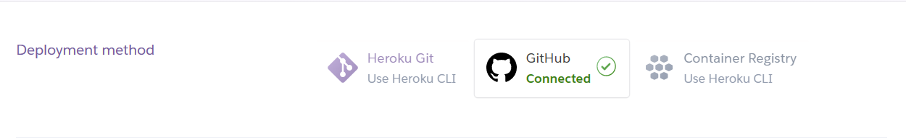
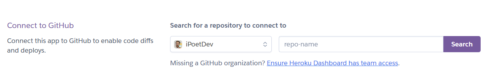
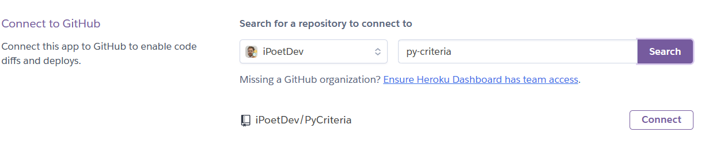
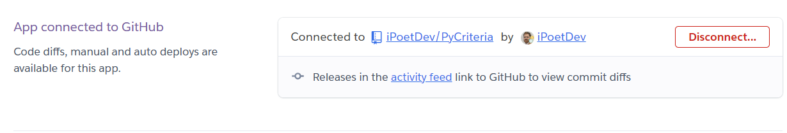
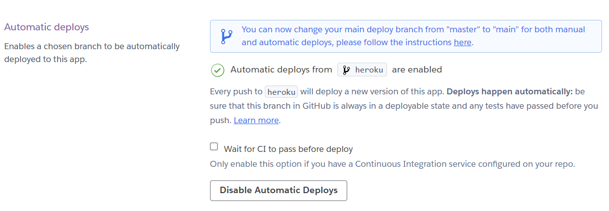
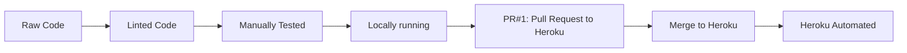
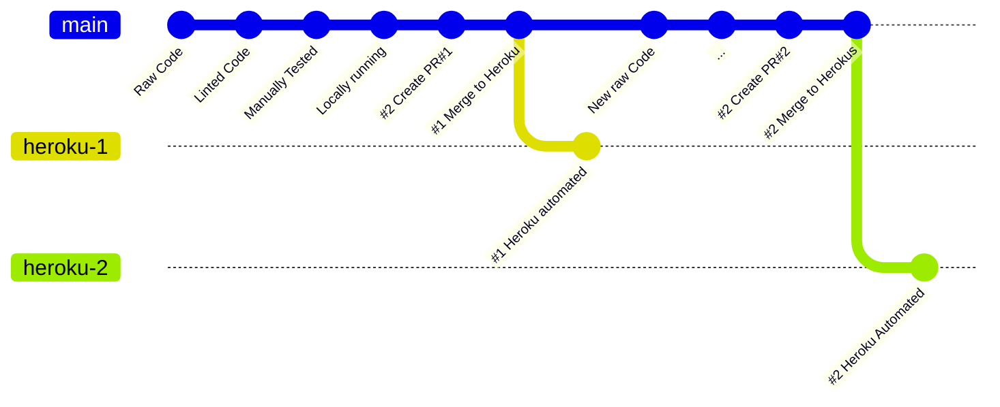

# Project Criteria

## 1.0 [Introduction](#introduction)

<!-- todo #1: add link-->
[Live App Here]( "No Link: Add Heroku URI")

<!-- todo #2: add image link-->


## 2.0 [Plan](#plan)

### 2.1 [User Experience](#ux)

### 2.2 [Audiences](#audiences)

### 2.3 [Requirements](#requirements)

## 3.0 [Design](#design)

### 3.1 [Business Logic](#business)

### 3.2 [Application Context](#app-context)

> LO: State Diagram, Activity Diagram

### 3.3 [Data Flow](#data-flow)

> LO: Flowcharts
>

### 3.4 [User Journey](#user-journey)

> LO: Flowcharts, Activity Diagram

## 4.0 [Build](#build)

### 4.1 [Environment](#enviornment)

#### 4.1.1 Interpreter

- Python 3.xx.xx
    - Local: Installed
    - Remotely:
    - Deployed:

#### 4.1.2 Isolation

- Venv:
- Docker:

#### 4.1.3 Infra Packages

- Pip
- Setuptools
-

### 4.2 [IDE/CDE](#ide-cde)

- PyCharm (Education) 2023.03

#### 4.2.1 [Plugins](#plugins)

- CodeStream
- Synk
- MyPy,
- PyLint
- PyCrunch
- Sourcery
- Gherkin, Cucumber+
- TODO
- Toolset

### 4.3 [3rd Party Libraries](#3party)

> Frameworks Used: Programs, packages, libraries used in workflows, and in the app code.

### 4.4 [3rd Party Tools]()#3party-tools)

- Mermaid
- Draw.io

### 4.1 [Repository](#repository)

## 5.0 [Code](#code)

### 5.1 [Features](#constructs)

> LO

### 5.2 [Code Patterns](#codepatterns)

## 6.0 [Reliability](#qa)

### 6.1 [Testing & Validation](#testing)

### 6.3 [Static Analysis](#static)

### 6.3.1 [Code Quality](#quality)

#### 6.3.1.1 Ruff

> See `.pyproject.toml` for configuration and evaluation of configuration.

- **Summary**
    - `ruff check .` when in the root of the project,
    - run via the terminal and after `venv/Scripts/activate.ps1` is activared
    - Ruff mirrors Flake8's rule code system, in which each rule code consists of a one-to-three letter prefix, followed
      by
      three digits

- **Possible Linters**: [Ruff Rule](https://beta.ruff.rs/docs/rules/)
  `ruff linter` from the terminal in the root of the project.
  > Ruff supports over 500 lint rules, many of which are inspired by popular
  > ... tools like Flake8, isort, pyupgrade, and others. Regardless of the rule's origin,
  > ... Ruff re-implements every rule in Rust as a first-party feature.

 ````
  PS D:\Code\Code Institute\PyCriteria> ruff linter          
   F Pyflakes   
 E/W pycodestyle
 C90 mccabe
   I isort
   N pep8-naming
   D pydocstyle
  UP pyupgrade
 YTT flake8-2020
 ANN flake8-annotations
   S flake8-bandit
 BLE flake8-blind-except
 FBT flake8-boolean-trap
   B flake8-bugbear
   A flake8-builtins
 COM flake8-commas
  C4 flake8-comprehensions
 DTZ flake8-datetimez
 T10 flake8-debugger
  DJ flake8-django
  EM flake8-errmsg
 EXE flake8-executable
 ISC flake8-implicit-str-concat
 ICN flake8-import-conventions
   G flake8-logging-format
 INP flake8-no-pep420
 PIE flake8-pie
 T20 flake8-print
 PYI flake8-pyi
  PT flake8-pytest-style
   Q flake8-quotes
 RSE flake8-raise
 RET flake8-return
 SLF flake8-self
 SIM flake8-simplify
 TID flake8-tidy-imports
 TCH flake8-type-checking
 INT flake8-gettext
 ARG flake8-unused-arguments
 PTH flake8-use-pathlib
 ERA eradicate
  PD pandas-vet
 PGH pygrep-hooks
  PL Pylint
 TRY tryceratops
 NPY NumPy-specific rules
 RUF Ruff-specific rules

 ````

#### 6.3.1.2 Pylint

> Integrated into PyCharm, so this is the defacto problem matcher for the IDE.

#### 6.3.1.3 MyPy

## 7.0 [Deploy](#deploy)

### 7.1 [Features](#features)

### 7.2 [DoD](#done)

> See [Definition of Done](_docs/done.md)

### 7.3 [Deployment](#deployment)

### 7.3.0 Build and Deploy Status Log

PR | Year | Date | Time | Build | Time | Deploy | Overall Status | Method | Pipeline | Name
----:|:----:|:-----:|:---:|:-----:|:---:|:---:|:------:|:----:|:----|:----:|:----
#1 -v3| 2023| 05-02 | 10:50 | Passing | 10:51 | v3 Failing | Not Ok | Automated | Staging | deploy-auto
#2 | 2023| 05-0x | - | --- | - | --- | Ok | Manual/Automated | - | -

> #2 | 2023| 05-0x | --- | --- | Ok | Manual/Automated

#### 7.3.1 [Heroku Create App](#heroku)

- 1: Login to Heroku, and verify and MFA authenticate
- 2: Create a new app.
  
- 3: Choose a deployment method. ``GitHub``
  
- 4: Connect to GitHub and search for the repository: ``PyCriteria``
  
- 5: Connect to chosen Repository and verify
  
  
- NOTE: ___ADR Decision___: Decide the selection of the branch to deploy to:
    - Decision: ``heroku``, as a protected branch
        - Use **Trunk based development** from the ``main`` branch to ``heroku`` branch
        - Commmit Style: Push to ``main`` for development codebase.
        - Tag Code ready for deployment: Push to ``heroku``
        - Deloyment is automated via Heroku's app deployment
        - By not having automated deployment on ```main```, there is no failed deployment
          noise on ``main`` branch and in the logs.
- 6: Deploy to Heroku
  

#### 7.3.1.1 App Information

Name | Region | Stack | Framework | Slug Size | ConfigVars | Buildpacks | SSL Certs | Repo | Local Git

------------:|:-------|:----------|:----------|:-----------|:-----------|:--------------|:----------|:--------------------|:--------
py-criteria | Europe | heroku-22 | Python | 30/500 MiB | In Use | heroku/python | None |
iPoetDev/PyCriteria |https://git.heroku.com/py-criteria.git

#### 7.3.2 Heroku Branch Deployment

1. Pull Request from ``main`` to ``heroku`` branch for deployment
2. Protect ``heroku`` branch from changes or having anything pushed
3. Merge from ``main`` to ``heroku`` branch for each release
4. From `raw/new code` -> `linted code` -> `manually tested` -> `locally running` -> `PR#1` -> `Merge to Heroku` ->
   `Heroku Automated`

**A1: Heroku Release Flow**



**A2: Heroku Commit Flow**



#### 7.3.2.1 Heroku CLI Logs

> CLI Documentation: [Heroku CLI](https://devcenter.heroku.com/articles/heroku-cli)

```bash
heroku logs --tail
```

#### 7.3.3 Repository Service

- [GitHub.com](https://www.github.com) is the chosen remote code repository service being used.

      User | Profile | Repo | Link                                   | Visibility | Issues

----------:| :--- | :--- |:---------------------------------------|:--- |:---
@iPoetDev | @iPoetDev | PyCriteria | https://github.com/iPoetDev/PyCriteria | Public | Issues

#### 7.3.5 Local Git Service / IDE ✅

- PyCharm configured with GitHub account for Local development environment.
- Utilised a modified/reduced Changelog format to document the changes, a-la, Keep a Changelog.
    - Directly in the commit messages.
    - Reduced efforts by not maintaining the ``changelog.md``, which is abandoned.
- Mostly adhered to Semantic Versioning approach.
    - Minor adjustment was to put a double-digit index for each separate commit if several occurred on one day.

#### 7.3.6 Deployment Environment ✅

- Heroku is the cloud environment to deploy too:
- Deploy a static web page off every commit.
- Once the commit is built, then deploy the new website and pushes to hosted domain URI.
- Heroku is the hosted domain URI and service.
- The final URI is
    - Plain Text:
      ``` https://py-criteria.herokuapp.com/ ```
    - Link: [https://py-criteria.herokuapp.com/](https://py-criteria.herokuapp.com/ "PyCriteria: https://py-criteria.
      herokuapp.com/")

## 8.0 [Assessment](#assessment)

### 8.1 [Author](#author)

### 8.2 [Credits](#credits)

### 8.2.1 [Guides](#guides)

> Articles | Tutorials | Resources | Books

### 8.2.2 [Videos](#videos)

> YouTube | Online 
