<!-- markdownlint-enable -->
<!-- markdownlint-disable -->
# Project Criteria

## 1.0 [Introduction](#introduction)   <small><sup>✅</sup></small>

- Data-centric command line interfaces are increasingly popular, for a wide set of use cases and implementations to model the architecture and design against these use cases; particularly in high speed trading and larger data-modeling environments.
- In these use cases, performances is everything and using an non-graphical interface is more optimal than a GUI driven one.
- This is a simple example of a command line interface that models after the popular `aws cli` by being command and options, i.e. user controls, driven over an nested command structure to manipulate the data in a google sheets as a simple Project Management format managing Code Institute's own project assignments and criteria.

### 1.0.1 [Goals](#project-goals)   <small><sup>✅</sup></small>


- This app will provide users with:

1. To be able to load spreadsheet data from Google sheets as a two dimensional view in a terminal window.
2. To be able view of data is a replica of the data in a table and individual cards format in a terminal window.
3. To have a/any user, of any experience, to find and locate, by pre known identifier, a slice of the data, as a record.
4. To have a/any user, of any experience, to edit the row's record, by one of the four following editing tasks:
    1. Add a note to the record, at the location.
    2. Update the note in the record, at the location.
    3. Delete the note in the record, by clearing only that location.
    4. Toggle to TODO in the individual records for that location.
5. To have a/any user, of any experience, preview the changes by comparing the record side by side.
6. To have a/any user, of any experience, save. commit and then refresh the new data with the remote. 

## 1.1 [Live App](#live-app)   <small><sup>✅</sup></small>

[Live App Here](https://py-criteria.herokuapp.com/)

## 1.2. [App Visuals](#app-visuals)   <small><sup>✅</sup></small>

<!-- todo #2: add image link-->


----
> |
----

## 2.0 [Plan](#plan)   <small><sup>✅</sup></small>

### 2.1 [User Experience](#ux)   <small><sup>✅</sup></small>

- Any user, regardless of experience, should be intuitively able to use the auto-completed command prompts found in this CLI.These command prompts are the only possible user controls. 
- The **`tab`** and **`space`** keys are core keyboard input (user) controls that can be intuitive to use, quick to learn and become familiar with.
- Inexperienced users should operate when they start using the commands; without the hesitancy of entering the wrong command or option and avoid freezing in a panic of *"oh no, what do I do now?"* or *"what have I just done"*. This anxiety is magnified by navigating in a low fidelity experience that are common line interfaces, i.e all black screen and white text.
    - *i.e.*, For instance, most non-technical users fear and avoid using CLI apps if they cannot help it for these very
      reasons below.
    - *e.g.,* 
           i) The lack of feedback from the immediacy of their actions and 
          ii) the lack of a clear path to recover from these actions.
    - GUI applications tend to be more forgiving and givings inexperienced users more comfortable and feedback in
      what they are doing and how to recover from mistakes.
- Any user, regardless of experience, should be able to use the application without having to read the documentation or help files.
- However, the user should be able to access the help files and documentation, if they need to, in the cli in the context of the command prompt. 
  - Say by the, for example, entering *'--help'*, or *'-h'* as an option to the command prompt.


**CLI Commands:**
>  *BASE > INTENT > ACTION*
- A CLI command, an *ACTION* to be nested, i.e, grouped by it organizing *INTENT*, in the following schema, e.g.
  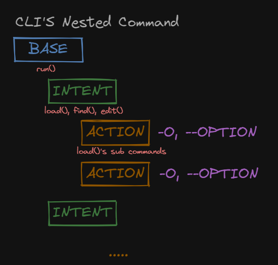  
- The CLI commands and options should allow the user to complete their objectives as simply as possible.
    - **These tasks (`intent`/`actions`/`options`/`values`) are be to:**<br>
      - A. **Load** the data from the remote source.
      - B. **Select** *different views* of the data, and refining the quantity of the views, either
          - 1. By reducing the number of columns in the view - selecting from options of a preset views of columns.
          - 2. By reducing the number of rows, due to the constraints of the terminal window, so to **page** (i.e., to **browse**) across larger data sets.
      - C. **Find** the data by row identifier, as gleamed from their viewing of the larger data set.
          - 3. **Locating** by row identifier for an exact match.
          - 4. *[Future feature]* Searching by querying all the data in the data set for a partial match or exact match.
          - 5. *[Future feature]* Filtering data viewed in the data set for a partial match or exact match.
      - D. **Edit** the data in the row, by one of the 4 following tasks:
          - 6. **Add** a note to the record, at the location
          - 7. **Update** the note in the record
          - 8. **Delete** the note in the record, by clearing the location
          - 9. **Toggle** to TODO in the individual records
- The CLI should allow the user to manage their projects from the CLI, while they are developing other CLI apps and, so can update their projects achievements by adding notes and checking off of TODOs per project learning objective and criteria.
- This CLI application only reached MVP level and therefore has potential for more development effort to be planned for.

### 2.2 [Audiences](#audiences)   <small><sup>✅</sup></small>

> Purpose for addressing critical goals: LO8.4.3. (Merit)

> These audiences types are lofty and may be aspirational, but they are the target audiences for this application.
> And some are just for the memes, in a "drink your own champagne way".

- Developers looking to understand how to develop and design multiple levels nested command line interfaces.
- Data Scientists looking to understand how to extract, transform and load data from spreadsheets by CLI interfaces
- Code Institute students looking to understand user OOP as a design pattern for CLI applications, and how to implement it in Python.
- Code Institute assessors as potential clients and users / owners of the Project Criteria for Code Institute assignments; <small>and as fun meme of using the Criteria data in ths project.</small>
- The author of the project; keeping him on track and on target for the project criteria and delivery of project.

### 2.3 [Requirements](#requirements)   <small><sup>✅</sup></small>

#### 2.3.1 [Drivers](#driving-requirements)   <small><sup>✅</sup></small>

- The requirements of this application were defined by the project criteria of
    1. [LO7.0] `"... to manage, query and manipulate data ..."` in a real-world domain.
    2. The aforementioned real world domain is the:
       a. intersection of CLI design for inexperienced developers learning python.
       b. building familiarity with common developer tools like AWS's CLI or GitHub's CLI or Heroku's CLI, all cli tools that Code Institute developers and students become to be familiar with.
       c. .. and who are learning to manipulate datasets from a predefined source initially.
    3. The development of a `CREATE, READ, UPDATE, DELETE` (CRUD) application for a dataset was the driver.
    4. Additionally developing `ETL` and `Find/Locate/Search` operations where also the drivers for the application's features.

#### 2.3.2 [Business Case](#business-requirements)   <small><sup>✅</sup></small>

- The business case of this kind of application is to demonstrate the utility, and the RoI's value add, of CLI applications for accessing remote data varied datasets from the command line, although this is only a MVP solution so it is bare bones and not fully featured.
- This was inspired by the listings to the creator of the *'**rich**' CLI python library* on [Talk Python podcast, episode #366, titled: ""Terminal magic"" with Rich and Textual"](https://talkpython.fm/episodes/show/366/terminal-magic-with-rich-and-textual)
- Additionally, the design of the command line the user interfaces interactions was heavily influence the by [Maurice Brg's article on Advanced CLI with Python and ClI](https://mauricebrg.com/article/2020/08/advanced_cli_structures_with_python_and_click.html).
  - The specific reference of Amazon's 'aws cli' application was particularly interesting and very useful. 
  - It also demonstrates the business case of multi-commands CLIs and who the user targets audience is.

#### 2.3.3 [Data Requirements](#user-requirements)   <small><sup>✅</sup></small>

- The data model comes from the very own project criteria for the Code Institute assignments.
- A version of the data, which is available at CI's own github pages site: https://code-institute-org.github.io/5P-Assessments-Handbook/portfolio3-prelims.html
- Having had prior experience with breaking down the data model, the author did a manual extraction and transformed the source into a 14 columns (fields) by 70 row spreadsheet format.
- This spreadsheet is available [here](https://docs.google.com/spreadsheets/d/1qOPVOTm5oS9G0feggujXwzfo5TsD8yMxkdBfPTdpBm0/edit?usp=sharing), under the `Data` tab:
    - The following fields are **source data native**:
        - `Performance`, alias for a Grade, `Pass`, `Merit` (and `Distinction`, not included).
        - `Tier` (Learning Outcome label) for Top level `Outcomes`.
        - `TierPrefix` - `'LO'` is a prefix for the `Outcome` value from `Tier`.
        - `CriteriaGroup` - The `LO'n` indicator for the Learning Outcome grouping/ordering
        - `Criteria` (Learning Outcome text)
    - The following fields are **source data derived**:
        - `Tier` - The `Criterion` value as a sub part of a Learning Outcome, as many criteria make sense outcome.
        - `TierPrefix` - `'LC'` is a prefix for the `Criterion` value from `Tier`.
        - `TierDepth` -: By using a dotted notation of the depth of details in the criteria group, e.g., `1.1.1` for`Criteria References` (), the depth is `3`, you could atomize the criteria groupings into its smallest constituent parts.
          - i.e. Depth is how deep this breaks down is. 
          - Potentially useful for extracting data transformations operations on top of data without complicated analysis.
        - `LinkedRef`(*-erences): Associated with references that are all similar nature or have overlapping contexts or topics. Its a way fo linked similar.
    - The following fields are **author sourced**
        - `DoD`, alias for *Definition of Done*: Thinking, this could be a planning or parent field to the `ToDo`. Alias for `ToDo`, where Done is not equal to DoD. Such as an LO is not done (DoD) until all criteria are done (Todo's Done).
        - `CriteriaTopic`: Author's own taxonomy for the categories of the criteria. 
        - `Progression`, alias for `ToDo`
        - `RowID`: To be deprecated. A datasets plot that googles sheet's row number, which is a +1 based index, as the header row are the field/column labels.
        - `Position`: A non-zero'd index identifiers for the row, given that most data structures are N-1 indexed,
          starting from zero position. This is more human readable and user intuitive, i.e *"the row I want has the ID I know."*

#### 2.3.4 [User Stories](#user-stories)   <small><sup>✅</sup></small>

- As a user, I want to be able to *load data* from a Google sheet.
- As a user, I want to be able to *view data in a table*, for bulk /grouped data. 
- As a user, I want to be able to *view data in a  individual card* format for individual record.
- As a user, I want to be able to *find/locate a record* by row identifier.
- As a user, I want to be able to *edit a record* by *adding a note* to the location.
- As a user, I want to be able to *edit a record* by *updating the note* in the location.
- As a user, I want to be able to *edit a record* by *deleting the note* in the location.
- As a user, I want to be able to *edit a record* by *toggling the TODO* in the individual records.

### 2.4 [Future Features](#future-requirements)   <small><sup>✅</sup></small>

In the future, this application could be extended to include, in increasing order of implementation/complexity/challenge:

1. **Search** and **locate** data by phrase or text search (down columns, and across rows, across all axes).
2. **Edit** more than `Notes` and `ToDo/DoD` fields, but also the other `mutable` fields in the record.
   - Given that some fields are immutable, as the source data's information is required to be fixed, only derived data or author's own field data (variable fields) could be edited.
3. **Add**, *single or by bulk,* new records to the spreadsheet by complete rows:
    - It must be noted that the source dataset is predefined and fixed; and as such, is not intended to be extended by the user.
    - However, the current dataset is incomplete with showings only PASS and MERIT grade performance outcomes.
    - It is feasible that in the future, the user could add Distinction levels outcomes to the dataset as individual criteria, with one limitation, these do not have dotted notation numerical references like Pass and Merit do.
4. **Add** *dates and times* of when tasks were completed (by adding a date-done column), as user generated values.
5. **Bulk editing** *(add/update only)* of similar values / for same search term.

The application was designed for future development and testing in mind; however, times and the minimum viable product were the overriding priorities and constraints. This includes a nascent `debug` mode being encoded into the design as *a developer feature*, as the application's complexity increased, using alternate Rich's print/inspect or Clicks' echo, for checking dataflow and object constancy. This could be used in a developer mode and set by global settings in future future variants of the code base, and enabled by a flag at command level.

----
> |
----

## 3.0 [Design](#design)  <small><sup>✅</sup></small>

### 3.1 [Business Logic](#business)  <small><sup>✅</sup></small>

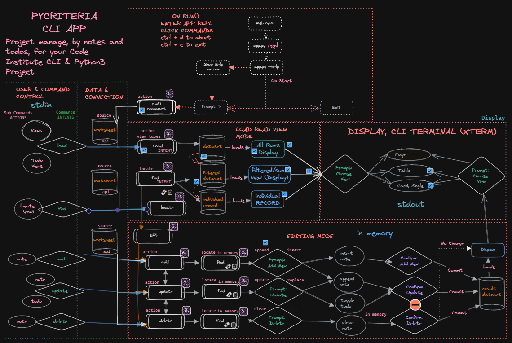

#### 3.1.1. Key / Business Logic Guide  <small><sup>✅</sup></small>

- `ENTER THE REPL/APP`
   - 1: INTENT: connection, via remote access and API authorisation, from API Provider on run() 
- `LOAD READ VIEW MODE`
  - 2: INTENT: Loading data, via two ACTIONS (e.g. Todo, Views) from the Datasource (e.g. Worksheet.Local DataFrame) as a complete | filtered dataset AND display of such ina table or paged display in the CLI
  - 3 & 4: INTENT: Finding data, via one ACTION (e.g. Locate(rows)) and two OPTION/VALUE inputs (e.g. Search (disabled), Index (row Id)) from Datasource (e.g. Worksheet/ Local DataFrame) as a invidual record AND displayed in a individual record card as a card format in the CLI'S terminal
- `EDITING MODE`
  - 5 & 3: INTENT: Edit Mode & Locate (3 & 4): Edit mode depend on Find/Locate logic0 
  - 6, 7 & 8: INTENT: Finding data, via four ACTIONs (e.g. Add Note, Update Note, Delete Note, Toggle Todo (an Update variant)) and two OPTION/VALUE inputs per action (e.g. Search (disabled), Index (row Id)) from Datasource (e.g. Worksheet/ Local DataFrame) as a individual record AND displayed in a invidual record card as a card format, either side by side or as final edited record view in the CLI'S terminal
- `COMMAND MODES`
  - --help is provided on run and at each command level (Intent or Action), as well as per option.
  - Automcomplete aids the users's navigation, using **`tab`**, **`space`**
  - Additional `aborted`, `interupt` actions by the user are **`ctl + d`**, **`ctl + c`**, althought the last two may force the application and user to start over; **by design**.

### 3.2 [App Design & Constriants](#app-design-constraints)  <small><sup>✅</sup></small>

> - NOTE: This is a data intensive application, by design, with dense information in a structural layout, as such

#### 3.2.1 [Constraints](#design-constraints)  <small><sup>✅</sup></small>

1. *No to Mobile screens & Usage:*
   - This App needs a wider viewport (terminal window) than 80 cols ot 720px. 
     - Consequently this means that this excludes standard size and pro size mobiles upto this width (even in mobile landscape)
     - **Constraint** Does not serve Mobile Users
2. *Dimensions:* 
   - Without Zoom or Pinch and Zoom, this measures 1230px x 1128px
   - Consequently this only include Pro size Tablets, 13inch laptops (with thin bezels) and all desktop monitors at standard resolutions of 1080p or higher/denser
   - Fortunately this fits with modern laptop and tablet
   - Unfortunately this exludes the 70P User and low end mobile, laptops (780p) and low end desktops
   - It also exluced Proffessioal Users on their high end mobiles
3. *Intent Contraint:*
   - Given the data intensity of data display and accuracy requirements of data input this CLI is never envisioned to be targetted at Mobile users or low end user uses cases.

#### 3.2.2 [App Design](#app-design)  <small><sup>✅</sup></small>

> NOTE: The author modified the defacto terminal window dimensions (80 cols by 24 rows) to suit his Business and Design Use Case

1. **Business Case**
   - This is a application of a CLI design for data driven use cases
   - This is modeled after a CLI accessing a spreadsheet of undeterminate lenght of rows
   - This is intended to display all the data on the screen for *reading* and *browsing* for the user to reference the data row identities.
   - A business user would use this in lieu of web based access for rapid data modification or even script based modifications of datasets at scale, hypothetically.
   - A college user & a coder, in this configuration, would use this to rapidly adjust his progress on his project without context switching from the terminal to a web page; thus breaking his flow.

2. **Design Case**

- Data Dense and Intense Display: Columnar data of predefined views, i.e. sub-views, based on the Intent/Action (i.e. Task and Outcome) of the user
  - 1. `load todo` Use Case in **Loading Mode**: The User wants to quickly access and see his actionable items in different configurations; in bulk so to read and browse the whole data.
  - 2. `load view` Use Case in **Loading Mode**: The User wants to step back and see the assignment views like overview and reference meta data; in bulk so to read and browse the whole data.
- Fast Locate and Display of Individual Record in a Card Format
  - 3. `find locate` Use Case in **Finding Mode**: The User wants to locate and view an individal record in a different layout to inspect and reflect on the data record in a more readable fashion than a tabular layout and horrizontal row data.
- Code Reuse of the Finding/Searching
    - The application reuse of `find locate` Use Case: Code reuse is part of code efficiency, so this logic/algorithm forms the basis of the **Editing Mode**
- Editing a value of Notes and Progress.
  - 4. `edit note` Use Case in **Editing Mode**: The User wants to locate an individual record to edit/modify via the three tasks of adding, updating and deleting, in this instance, a Note field of an individual record.
  - 5. `edit progress` Use Case in **Editing Mode**: The User wants to locate an individual record to edit/modify via the three tasks of adding, updating and deleting, in this instance, a Progress field of an individual record, and based on progression, the Defintion of Done field.
    - A sub use case, potentially, is to report on the progression of the Definition of Done and filter out the various computed field values. 
    - This is not implemented. This filtering pattern could be used to reduce the number of rows on display by certain common values.

3. **Code & Logic Design**

For further insights into the code and logic of the app. [See here for Code & Logic Flows](.docs/classes.md)

### 3.3 [Application Context](#app-context)  <small><sup>✅</sup></small>

> State Diagram, Activity Diagram

#### 3.3.1 [State Diagram](#state-diagram)  <small><sup>✅</sup></small>

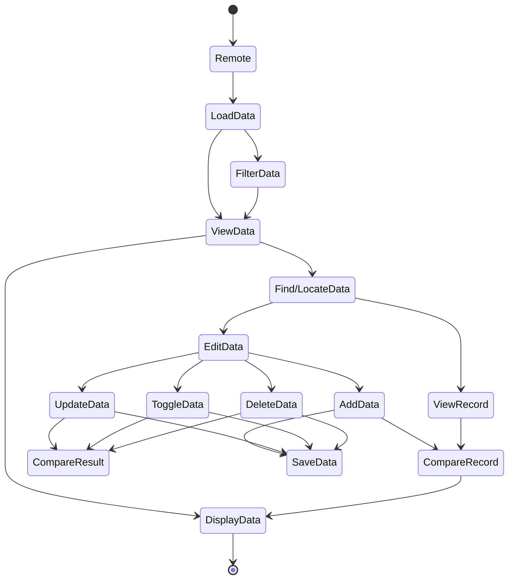
```mermaid
stateDiagram
	[*] --> Remote
	Remote --> LoadData
	LoadData --> ViewData
	LoadData --> FilterData
	FilterData --> ViewData
	ViewData --> DisplayData
	ViewData --> Find/LocateData
	Find/LocateData --> ViewRecord
	Find/LocateData --> EditData
	EditData --> AddData
	EditData --> UpdateData
	EditData --> ToggleData
	EditData --> DeleteData
	AddData --> CompareRecord
	UpdateData --> CompareResult
	ToggleData --> CompareResult
	DeleteData --> CompareResult
	AddData --> SaveData
	UpdateData --> SaveData
	ToggleData --> SaveData
	DeleteData --> SaveData
	ViewRecord --> CompareRecord
	CompareRecord --> DisplayData
	DisplayData --> [*]
```

#### 3.3.2 [Activity Diagram](#activity-diagram)  <small><sup>✅</sup></small>

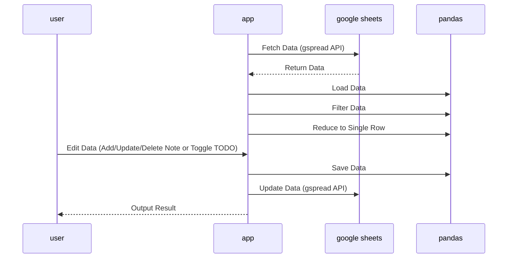
```mermaid
sequenceDiagram
	participant user
	participant app
	app ->> google sheets: Fetch Data (gspread API)
	google sheets -->> app: Return Data
	app ->> pandas: Load Data
	app ->> pandas: Filter Data
	app ->> pandas: Reduce to Single Row
	user ->> app: Edit Data (Add/Update/Delete Note or Toggle TODO)
	app ->> pandas: Save Data
	app ->> google sheets: Update Data (gspread API)
	app -->> user: Output Result
```


### 3.4 [User Journey](#user-journey)  <small><sup>✅</sup></small>

> Flowcharts, Activity Diagram

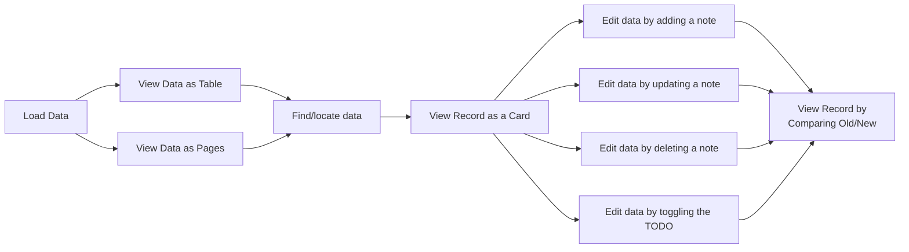
```mermaid
graph LR;
A[ Load Data ] --> B[ View Data as Table ];
A --> C[View Data as Pages ];
B --> D[ Find/locate data ];
C --> D;
D --> D1[ View Record as a Card ];
D1 --> E[ Edit data by adding a note ];
D1 --> F[ Edit data by updating a note ];
D1 --> G[ Edit data by deleting a note ];
D1 --> H[ Edit data by toggling the TODO];
E --> I;
F --> I;
G --> I;
H --> I[ View Record by \n Comparing Old/New];
```

----
> |
----

## 4.0 [Build](#build)  <small><sup>✅</sup></small>

### 4.1 [Environment](#enviornment)  <small><sup>✅</sup></small>

#### 4.1.1 [Interpreter](#python-interpreter)  <small><sup>✅</sup></small>

- Python 3.11.03
    - Local: Installed
    - Remotely: Heroku via runtime.txt
    - Deployed: 3.11.03 and Heroku Buildpacks
- venv
- Pip

### 4.2 [IDE/CDE](#ide-cde)  <small><sup>✅</sup></small>

- PyCharm (Professional) 2023.03

#### 4.2.1 [Plugins](#plugins)  <small><sup>✅</sup></small>

- CodeStream
- Synk
- MyPy,
- PyLint
- PyCrunch
- Sourcery

### 4.3 [3rd Party Libraries](#3party) <small><sup>✅</sup></small>

> <sub>Frameworks Used: Programs, packages, libraries used in workflows, and in the app code.</sub>

#### 4.3.1 [Standard Libraries](#standard-libs) <small><sup>✅</sup></small>

> <sub>*Internal Library | Class or Function or Object*</sub>

**In Code**
- `dataclasses` | `dataclass`
- `typing` | `Tuple`, `NoReturn`, `Type`, `Literal` 
- `pathlib` | `Path` 
- `importlib` | `util`
- `datetime`
- `tracemalloc`
- `warnings`

**In Workflows**

- PyLint: `pylint>=2.17.0` | PycHarm Integration | PyCharm Plugin | Command Line
  - And "plugins": 
    - `pylint-af`, `pylint-blank-line-plugin`, `pyling-common`, `pylint-core`, `pylint-import-requirements`, `pylint-mccabe`, `pylint-spelling`, `pylint-secure-coding-standard`, `pylint-venv`, `pylintconfig`,  `watchpylint`, ``,
- Ruff: `ruff>0.0.263` | Beta | Command Line `ruff check .`
- MyPy : `mypy>=1.2.0` | PyCharm Plugin | Command line `dmypy run --  --check-untyped-defs --follow-imports=error  .`

#### 4.3.2 [External Libraries](#external-libs) <small><sup>✅</sup></small>

> As installed by `requirements.txt`, locally into the Interpreters `venv` environment on per repo level and by the Heroku's buildpacks upon deployment.

#### A: TUI/CLI

> Commands, Console Options, and REPL.

- `click>=8.1.3` | [PyPi](https://pypi.org/project/click/ "click 8.1.3") | [GitHub](https://github.com/pallets/click/) | [Homepage](https://palletsprojects.com/p/click/)
- `click-repl>=0.2.0` | [PyPi](https://pypi.org/project/click-repl/ "click-repl 0.2.0") | [GitHub](https://github.com/untitaker/click-repl) | [Homepage]()  
- `rich>=13.3.5` | [PyPi](https://pypi.org/project/rich/ "rich 13.3.5") | [GitHub](https://github.com/Textualize/rich) | [Homepage](https://rich.readthedocs.io/en/latest/)  

#### B: Data

> Local clients side data management.

- `pandas>=2.0.1` | [PyPi](https://pypi.org/project/pandas/ "pandas 2.0.1") | [GitHub](https://github.com/pandas-dev/pandas) | [Homepage](https://pandas.pydata.org/) | [Docs](https://pandas.pydata.org/docs/index.html)  

#### C: Google API/DATA Libraries

> Google API/DATA Libraries and Interfaces.

- `google>=3.0.0` | [PyPi]() | [GitHub]() | [Homepage]()  
  - `google.oauth2.service-account`
- `google-auth>=2.17.3` | [PyPi]() | [GitHub]() | [Homepage]()
- `google-auth-oauthlib=>1.0.0` | [PyPi]() | [GitHub]() | [Homepage]()
- `gspread>=5.8.0` | [PyPi]() | [GitHub]() | [Homepage]()  
- `gspread_dataframe>=3.0.8` | [PyPi]() | [GitHub]() | [Homepage]()  

#### D: Environment

> Environment variable management.

- `python-dotenv>=1.0.0` | [PyPi]() | [GitHub]() | [Homepage]()  

### 4.4 [3rd Party Tools](#3party-tools) <small><sup>✅</sup></small>

#### 4.4.1 [UI/UX](#ui-ux-tools) <small><sup>✅</sup></small>

- Mermaid |  UML Diagramming 
- Excalidraw.io | Drawing, Flowcharts, Ideaboards, Diagramming

#### 4.4.2 [GitHub Apps](#github-apps) <small><sup>✅</sup></small>

> - As cyber security informed professional, secure code as code quality matter, hence the use of CodeQl and Synk.

#### 4.4.2.1 *[Pull Requests](pr-checks)* <small><sup>✅</sup></small>

- GitHub CodeQL:  GitHub's Security Scanner : CodeQL / Analyze:
    - `(javascript) (dynamic)` | [JavaScript CodeQL](https://codeql.github.com/docs/codeql-overview/supported-languages-and-frameworks/#javascript-and-typescript-built-in-support) | [Homepage](https://codeql.github.com/)
    - `(python) (dynamic)`  | [Python CodeQL](https://codeql.github.com/docs/codeql-overview/supported-languages-and-frameworks/#python-built-in-support) | [Homepage](https://codeql.github.com/)
- Synk:
  - `security/snyk` | `synk-bot` (iPoetDev) | [GitHub](https://docs.snyk.io/integrations/git-repository-scm-integrations/github-integration) |  [Docs](https://docs.snyk.io/) | [Homepage](https://snyk.io/)
- Code Review Doctor: 
  - `django-doctor` | [Example](https://codereview.doctor/code-review-doctor/a-quick-example/django-and-python) | [Homepage](https://codereview.doctor/)
- codebeat: 
  - `codebeat`| [Docs: PullRequests](https://hub.codebeat.co/docs/pull-requests#section-tracked-branches) | [Homepage](https://hub.codebeat.co/)
- Sourcery:
  - `sourcery-ai`: Code Refactoring | [Docs]() | [Homepage](https://sourcery.ai/)

#### 4.4.3 [AI Codex Agents](#ai-codex-agents) <small><sup>✅</sup></small>

> <sub>AI Codex Agents: Programs, services, websites use in workflows, and in the app code.</sub>

> AUTHOR STATEMENT:  "[AI Codex Ethics and Use in Education] I reached out to the Code Institute for advice on the proper used and integration with coding assignments  on Friday 12th May 2023, titled: *"Accreditation of AI Agents".* "<br>
> "Without a statement from the education provider, the I declare myself as user of AIAgent Codex agents, as co-pilots and tutor alternates in the development of this code base, with the project in full disclosure and transparency so that there are no, or at least minimised, conflicts interests or suspicions/risks of plagiarism, in a best effort, fashion."

##### 4.4.2.1 [Codings Agents](#coding-agents) <small><sup>✅</sup></small>

- **PerplexityAI**: URL: https://www.perplexity.ai
  - *Does provides attribution for sources.*
- **Notion.com**: URL: https://www.notion.com and a paid subscription to the service for accessing [NotionAI](https://www.notion.so/product/ai)
 - *Does not provides attribution for sources.*
- **GitHub Copilot**: URL: https://copilot.github.com in PyCharm IDE.
  - This comes with the Students Developer Pack, as granted by the Code Institute.
  - Primary use case: code completion, not code generation.
  - *Does not provides attribution for sources.*
- **TabNine Pro**: URL: https://www.tabnine.com in PyCharm IDE, paid for Pro subscription.
  - Primary use case: code completion.
  - *Does not provides attribution for sources.*

#### 4.4.3 **[Code Generation](#ai-code-gen): <ins>Perplexity</ins>** <small><sup>✅</sup></small>

- Role: Code Pilot and Code (Sample/Example) Generation
- The author opted for PerplexityAI on the grounds of:
  - It is free.
  - It is web based behind a login.
  - Has ability to share the prompts and responses, via a link, as a complete record and as an accredited citeable source.
  - It has been evaluated by a leading university for its veracity as a AI search engine.
  - Rather distinctly, it quotes it's own sources (it's primary sources) for each prompt. 
    - The accuracy of these sources may vary with mileage and best effort use.
  - Meaning that if PerplexityAI is the author's primary source, and reference, these become the author's secondary sources for referencing.
  - By quoting sources, academic integrity and ethics can be upheld.
  - Perplexity is designed for Educational use cases, where these are expected norms.
- Alternative, until very recently (Google's PaLM2), codex agents does not supply their sources for attribution. 
  - Some (Microsoft, OpenAI and GitHub) are up for copyright infringement for code reuse without attribution.

>*Further Reading | Sources:*
> <sub><strong>Media</strong>:&nbsp;&nbsp;&nbsp;&nbsp;&nbsp;&nbsp;&nbsp;&nbsp;&nbsp;[YouTube: Machine Learning Street Talk: Perplexity AI](https://www.youtube.com/watch?v=_vMOWw3uYvk " Machine Learning Street Talk: 'PERPLEXITY AI - The future of search.'.  8 May 2023, First accessed: 10 May 2023")</sub> 
> <sub><strong>References</strong> &nbsp;[Standford University: Evaluating Verifiability in Generative Search Engines](https://arxiv.org/abs/2304.09848 "Nelson F. Liu, Tianyi Zhang, Percy Liang, 'Evaluating Verifiability in Generative Search Engines', 19 Apr 2023, Last accessed: 23 May 2023]") ||  [Download: PDF](https://arxiv.org/pdf/2304.09848.pdf)</sub>

#### **4.4.3.1 [Benefits](#ai-benefits)** <small><sup>✅</sup></small>

- Alternative solution to search engines and partials answers over 20 different tabs, impacting attention, focus and ability to executive process the information.
    - *Benefit*: Have a question about a coding, or 20, and your candidate drill down using generic examples
    - *Benefit*: Better search results relevance with the Perplexity search engine.
- Alterative to tutors for questions that are not covered by the course content and materials
    - *Challenge*: The CI Tutors have a pro-forma SoP to follow, and set times limits, needing much preparation, in my case [See example GitHub Issue](https://github.com/iPoetDev/PyCriteria/issues/33). 
    - *Benefit*:  An AI Agent is always available in the moment when an question arises, even outside of Tutoring hours, and respond to questions in highly personalized and preferential manner, without much preparatory overhead . 
    - *NOTE*: The Tutors do important work with new students and struggling learners.
- Alterative to StackOverflow etc
    - *Benefits*: StackOverflow can be very challenging for a user, frustrating and imprecise. The AI Agent can be more precise, timely and accurate.
    - *NOTE*: The author has successfully used Discord and a dedicated community for Click library, to solve an issue that even the Codex Agent did not solve, as the authors/experts can be very helpful with compound and complex questions. Humans are crucial in the right context, i.e. being Click auteurs and users.
- Development of  own authored ad hoc tutorials and never seen before Q&A session with contextual answers.
  - *Benefit*: The author becomes their own accredited source in partnership with the Codex Agent; by self referencing as the creator of new tutorials.
- Development of lines of original/generative/innovative thoughts and enquires.
- As a developer with strong neural and learning diversity:
  - *Benefit*: Improvements in accuracy, speed, and quality of the code generated by the AI Agent, as a co-pilot/partner, is a game changer.
- Improved to self care as a developer, and wellbeing, by lowering of cognitive load, stress and anxiety; by reducing information over-saturation.

#### 4.4.3.2 [Risks](#ai-risks) <small><sup>✅</sup></small>

- Being accused of plagiarism unintentionally.
- Not showing one's work and sources of the external code as attributions.
- Blindly accepting the responses of the AIAgent generated code as authentic and trustworthy, where even the risks of injected or insecure code is real.
- Improper handling and use of the generated code without attribution, referencing and accreditation.
- Lack of discernment and critical thinking insight when usings AI Codex agents.

#### 4.4.3.3 [Mitigation](#ai-mitigations) <small><sup>✅</sup></small>

- As a developer, the author keep all his responses from each prompt and the generated code in a separate file/location.
- As the author, it is important to have a process of reviewing the generated code and comparing it to the author's code, by requesting generic examples.
- The author often gives his written source code, started by the author, and prompts the AI Agent to:
    - a) *Inspect it and Explain it*. e.g. what this exception is or code from another source
    - b) *Inspect it and Analysis it*, or *Inspect and Assess it* for issues, bugs, and unseen/unforced errors.
    - c) *Inspect it and Refactor it* for improving the author's sourcing of ideas or improve author supplied code sample.
        - e.g. The author has a function that is not working and wanted to see how the AI Agent would write it.
        - e.g. The author has a function that gotten out of control with design and seeks to reduce code with improvement/recommendations by the AI Agent.
    - NOTE: The author is constantly refactoring the code improving his own source of re-organizing mhy own code without any AI agent. 
- Where the author has used AI Agent contributions to start off the new coding process, the author include the links of the generated code, Perplexity, and he then:
    - i. Uses the generated code as a starting point for his own code.
    - ii.Then the author refactor and reorganize the code to his own style and design, breaking it out and down into new functions and smaller code blocks..
    - iii. The author then add comments and annotations to the code to explain the code and his own thinking.
    - iv: The author then add the references and attributions to the code.
      > <sub>*E.g. From `controller.py`, Line 1149. This became the common design pattern for adding, updaing and deleteing notes, but much evolved from generated code as source.*</sub>
      > ```python
      >    def addingnotes(self, notes: str,
      >        location: int | None = None,
      >        debug: bool = False) -> None:
      >```
      > **<small>Sample function signature that was started by ai code generation</small>**

---
- By making the code declarations and being open about his use of AI Agent, the author is able to be transparent and hold his integrity and ethics to the highest standards; while still using emergent technologies with reasonable care and due diligence.
- The author has discussed his use use with his cohort and his mentor, so the author has publicly come out in favour of these and had other people quizzed him on his use of an AI Agent.
- With best efforts, the author has added all links from *PerplexityAI* to code supported by such efforts, where most applicable as per Learning Objective:
  - ` LO2. 2: Clearly separate and identify code written for the application and the code from external sources (e.g.
  libraries or tutorials)`.
    - Breaking this down:
        - ` LO2.2.1: Clearly separate code written for the application`.
        - ` LO2.2.2: Clearly identify code written for the application`
        - ` LO2.2.3: Clearly separate code from external sources (e.g. libraries or tutorials)`
        - ` LO2.2.4: Clearly identify code from external sources (e.g. libraries or tutorials)`
- The author cannot, on balance, including all links outside of a reasonable effort to do so, as much what was generated by enquiry was equivalent to iteratively learning from external sources, when not reusing another code, just to get familiar with external new concept or asking for question on that topic. 
- The rapid, sequential and branch like querying of these agents in their own context (behind logins) make for voluminous output and variable lines of enquiry to be usable as a citation. 
- Only the most pertinent, discrete and accessible prompt and responses are reasonably included here for citation purposes.
- All most pertinent links from AI Codex agents are included in their own sub-section in 8.0 Acknowledgements of this [README.md](readme.md "8.1 AI & Author") file.
- The author retains all generated enquiries from all sources for inspection and audit.

----
> |
----

## 5.0 [Code](#code) <small><sup>✅</sup></small>

### 5.1 [Code Convention](#codeconventions) <small><sup>✅</sup></small>

- [PEP8](https://www.python.org/dev/peps/pep-0008/) - Python Style Guide

- [PEP257](https://www.python.org/dev/peps/pep-0257/) - Python Docstring Conventions

- [PEP484](https://www.python.org/dev/peps/pep-0484/) - Python Type Hints

### 5.1.1 [Naming](#naming) <small><sup>✅</sup></small>

> A note on conventions: These are accepted norms; and they can also be pedantic and dogmatic at the same time.
> The author has used some or part of these conventions, where by tooling, linters and automation enforced or tailored such conventions. 
> The author has also used his own conventions, where he has found the accepted norms to be an impediment to his own coding, say for usings underscores: 
> - i.e. For neurally diverse developers, like the author, the use of underscores can be a cognitive load and a barrier to entry, and he prefers to use all lowercase conventions or simple wording for naming. I.e. for variable naming, this is the case.
> - So instead many cases, the author has not followed all the pythonic naming conventions, which are traditions with good intentions and intent; 
> - These conventions not always useful for intermediate aware developers who have coded before.<br>
> - Lets not 'bikeshed' these conventions.

>NOTE: Be advised the author would adhere to follow conventions & naming styles by mutual agreement, when working in a team environment, for consistency, alignment, and team maintainability. 
> The author is working for himself in ths project and has the autonomy to choose.

#### 5.1.2 [Docstrings](#docstrings) <small><sup>✅</sup></small>

> Source: https://betterprogramming.pub/3-different-docstring-formats-for-python-d27be81e0d68

> The author primarily uses the Sphinx Docstring Docstring format

- It is the one most likely to be autocompleted by TabNine/Github's' Co-Pilot. These tools, along with the Pycharm inspector, helped with the autocompletion of the documentation.

#### 5.1.3 [TypeHints and Typing](#typehints)

- The author is an explicitly typed coder and uses, as a coding style, explicit type hints and typing in his code. 
- PyCharm is configurable and is used to supply the type hints in the IDE.
- This is not true when with dual type casting in a same assignment or function return, in a few instances, which where causing side effects are (e.g. `panda.Series` v `panda.DataFrame` causing array of internal value to be `False` boolean values, not the actual values).

#### 5.1.4 [Issues](#issues) <small><sup>✅</sup></small>

> Goto https://github.com/iPoetDev/PyCriteria/issues?q=is%3A+issue+author%3A%40me+

- The author uses CodeStream and GitHub Issue tracker to track issues and bugs that are significant.
- The author also uses 3rd Party CI/GitHub apps to check for code issues, which are automatically logged as issues. 
  - These are activated during Pull Requests from `branch:main` to `branch:heroku` when pulling (pushing) code from GitHub to Heroku (see *Heroku Flow* in Deployment)
  - The following log issues they find, due to their default rules:
    - `Synk-bot`: Inspects for vulnerabilities and auto bumps versions of libraries found in package.json for Javascript and Python.
    - `sourcery-ai`: Analyses and refactors every pull request developers only merges highly quality, well-written code. [Link](https://github.com/marketplace/sourcery-ai). 
      - Only the author approves the PR request, or use this reporting to manually improve the code.
- The author fixed most other annoyances without documenting each and every traceback that happened, with one significant breaking exception.

#### 5.1.5 [IDE Code Style & Code Formatter](#ide-editor-codestyle) <small><sup>✅</sup></small>

> AUTHOR'S NOTE: For P3, the Author opted for local development, over cloud development environments, and deviated from VSCod* electron IDE to JetBrains PyCharms.

- PyCharm has a inbuilt code style editor, where codestyle, and thus code conventions are globally configured.
- PyCharm is pythonic focuses IDE specialising in Python.
- This code style editor allows for consistent and immediate code style and convention alignment. 

:------| :-------
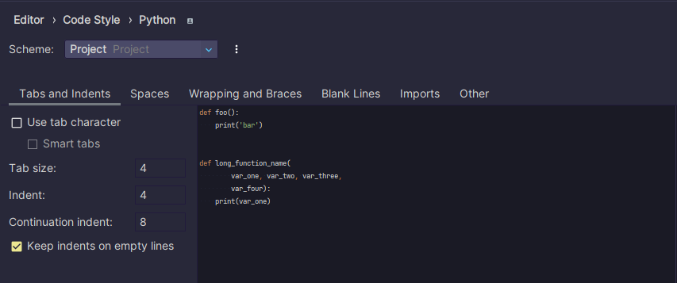 | 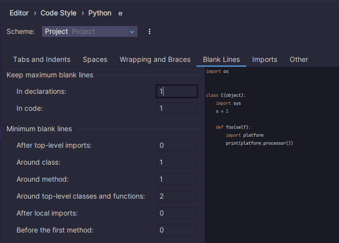

<br>

```Pycharm > Editor > Code Style: 1: Tabs & Indents | 2: Blank Lines```

:------| :-------
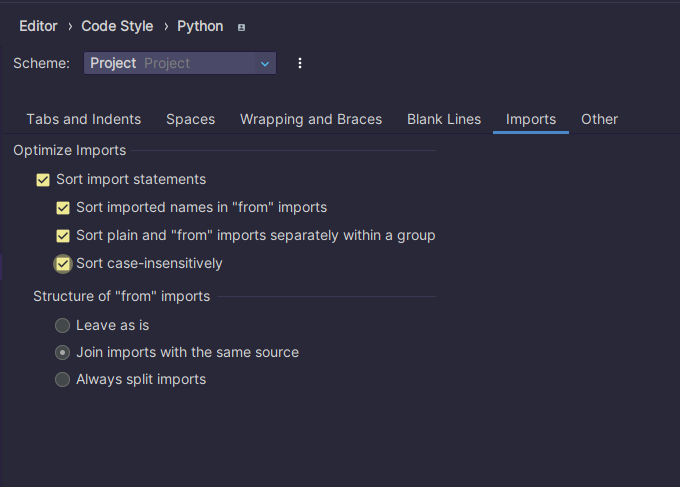 | 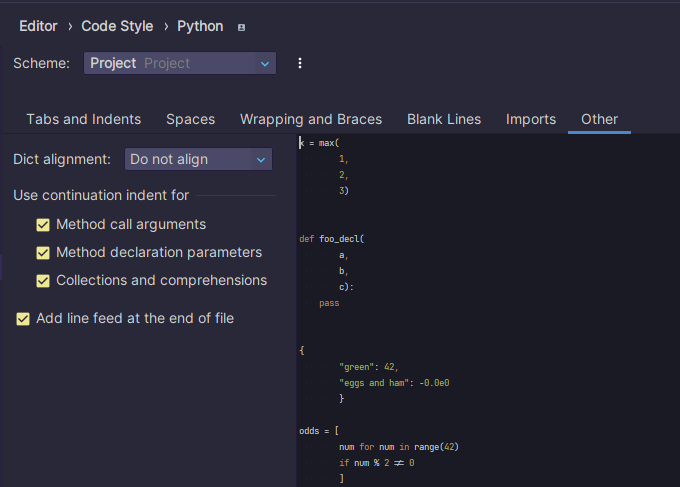

<br>

```Pycharm > Editor > Code Style: 3: Import | 4: Other Alignment```

:------| :-------
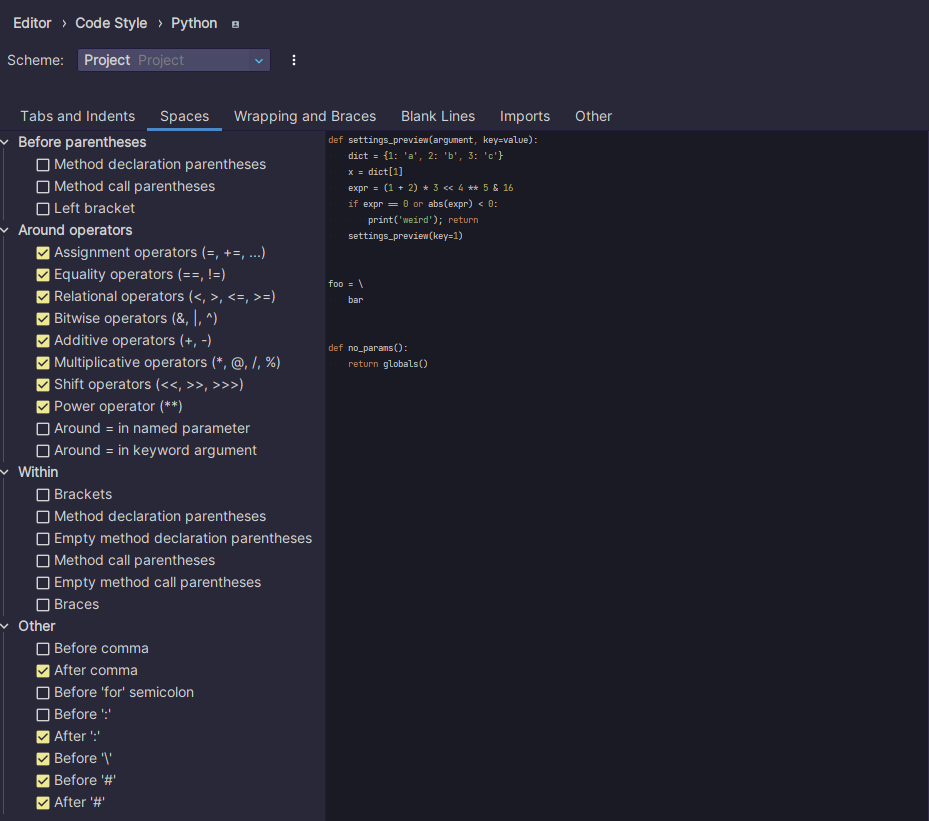 | 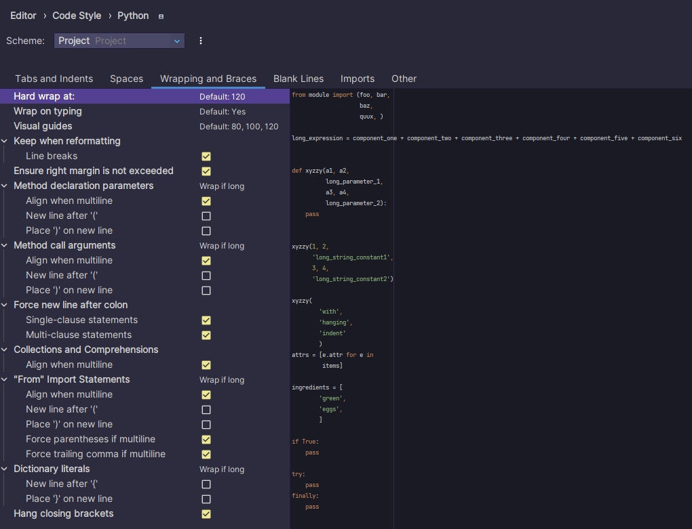

<br>

```Pycharm > Editor > Code Style: 5: Spaces | 6: WrappingBraces```

### 5.2 [3rd Party Library Choices](#3party-libraries-choices) <small><sup>✅</sup></small>
> Document the rationale as to why a particular library/libraries are necessary LO8.1.0 (Merit)<br>
> <small>**ADR**: (aliases: Architectural Decision Record, Any Decision Records): A format to document these decisions.</small>

#### 5.2.1 **`gspread` v `google`, and `google`: Remote Data & Authentication for Access** <small><sup>✅</sup></small>

- <ins>**ADR**</ins>: **To employ Google Sheets, via API access, as a *remote data* repository/data store.**
- <ins>*Libraries*</ins>: `GSpread`, `Google / OAuth` 
- <ins>*Use Case*</ins>: For Service Account access, API management and Remote Data Source.
- <ins>*Choice*</ins>: **`GSPREAD`**, using Google underneath.
- <ins>**Rationale**</ins>: <ins>Simplies the Google / OAuth API by being a wrapper around the authentication, authorisation, a resource access.</ins> 
- <ins>*Source*</ins>: LoveSandwiches, Code Institute.
- <ins>*Alternatives*</ins>: None considered.
- <ins>*Benefits*</ins>:
  - Gspread can handle read-write connections to Google spreadsheets.
  - Gspread produces one HTTP API call most of the time when you call a gspread method to fetch or update a sheet, which is more efficient than fetching data one by one in a loop or iterating over rows or columns
  - Code was developed for walkthrough and improved upon for this code base
  - Technical requirements were already defined/pre-known.
- <ins>*Disbenefits*</ins>:
  - Risk of rate limiting (HTTP 429 Errors) during testing. (see above).
  - Risk of other critical issues (credential leakage) and being blocked or banned by API owner.
  - Dependency on external provider to host and tolerate frequency of requests/responses.
  - Risk of not having a fall back API/Data Repository provider; or considering a simpler data structure for a data base.
- <ins>*Mitigations*</ins>:
  - Implemented: None.
  - Not Implemented: Logging (Python: Loguru, standard Logging), Own rate limit metrics, and reporting for app design flaws. 

#### 5.2.2 **`gspread` v `pandas`: Local Data** <small><sup>✅</sup></small>

- <ins>**ADR**</ins>: To use a 3rd party library to Extract Transform & Load (ETL) the local datase
- <ins>*Libraries*</ins>: `Gspread` v `Pandas`
- <ins>*Use Case*</ins>: For streamlined local dataset, i.e. two dimension array, management, without creating additional custom procedures to ETL the data or parts thereof
- <ins>*Choice*</ins>: **`PANDAS`: `PANDAS.DATAFRAMES` & `PANDAS.SERIES`**
- <ins>**Rationale**</ins>: <ins>Pandas is a third-party library that provides data structures for efficiently storing and manipulating large datasets.</ins> Pandas provides two main data structures: `Pandas.DataFrame` and `Pandas.Series` 
- <ins>*Source*</ins>: [Using GSpread with Pandas, from Gspread.org](https://docs.gspread.org/en/v5.7.1/user-guide.html#using-gspread-with-pandas)
- <ins>*Alternatives*: Gspread native and custom ETL procedures.
- <ins>*Benefits*</ins>:
  - Keeps all local, in memory data, in an efficient data structures.
  - Has inherent ETL functions, avoiding the need for custom development of access, transform, and other procedures.
  - Pandas allows integration of the worksheets returned from Gspread with a Pandas DataFrame using the gspread_dataframe package.
- <ins>*Disbenefits*</ins>:
  - Pandas is not as efficient as Gspread when it comes to handling read-write connections to Google spreadsheets. Pandas where not used for this, so this is not a concern.
- <ins>*Mitgations*</ins>:
  - Using Pandas for data analysis avoided the custom development of a slew of access, trandform and other procedures that `gspread` would have, and did start, to lead to . 


#### 5.2.3 **`click` v `typer` etc: [CLI Command, Option and Arugments Interfaces](#cli-interfaces)** <small><sup>✅</sup></small>

- <ins>**ADR**</ins>: **Select the optiomal library for creating CLI and prompt driven applications.**
- <ins>*Libraries*</ins>: `click` and `typer.
- <ins>*Use Case*</ins>: Command-line interface (CLI) creation in Python.
- <ins>*Choice*</ins>: **`CLICK` v8.1.4**
- <ins>*Rationale*</ins>:
  - Both `click` and `typer` are popular, and are related. libraries for creating CLIs in Python. However, based on the provided Piptrends data, `click` is far more mature and widely used library than `typer`, or the other alternatives. 
  - In terms of the features requested, both `click` and `typer` support prompting of custom values and are fully nestable and composable.
  - However, `click` implements its own parsing of arguments (as does `typer`, being built on `click`), which can be an advantage over libraries that use `argparse or docopt` 
  - While `typer` is built on top of click and provides a simpler interface with autocompletion, it may not be as powerful as `click` in terms of customization and flexibility.
    - Additionally, `typer` is less popular than `click` and may have a smaller community for support
  - <ins>Therefore, based on the above. **`click`** is the recommended choice for this use case.</ins>
- <ins>*Source</ins>: 
  - 1: [LibHunt.com: Typer v Click](https://python.libhunt.com/compare-typer-vs-click),
  - 2: [PalletsProjects.com: Why Click](https://click.palletsprojects.com/en/8.1.x/why/),
  - 3: [Tiangolo.com: Typer using Click](https://typer.tiangolo.com/tutorial/using-click/) i.e. is built upon.
  - 4: [PipTrends: argparse vs typer vs docopt vs click vs fire](https://piptrends.com/compare/argparse-vs-typer-vs-docopt-vs-click-vs-fire): Click far outpasses other CLI libraries.
- <ins>*Alternatives*</ins>: `typer`, `argparse`, `docopt`, `fire`.
- <ins>*Benefits*</ins>:
  - `click` implements its own parsing of arguments.
  - Widely used and mature library. See [Piptrends](https://piptrends.com/compare/argparse-vs-typer-vs-docopt-vs-click-vs-fire)
  - Customizable, composable and flexible.
- <ins>*Disbenefits*</ins>: 
  - May have a steeper learning curve than `typer`for having more features; 
    - Though on balance `typer` is more challenging to learn by being less mature.
  - May require more code to achieve the same functionality as `typer`.
- <ins>*Mitigations*</ins>:
  - Utilize the extensive documentation and community support for `click` to overcome any learning curve or code complexity.
  - Has a discord community, where the author asked a question that promptly solved.
- 
#### 5.2.4 **`rich` v `click.secho`: CLI Output and Style** <small><sup>✅</sup></small>

- <ins>**ADR**</ins>: **Help style and Layout the Terminal/CLI Standard Output stream.**
- <ins>*Libraries*</ins>: `rich` and `click.secho`
- <ins>*Use Case*</ins>: Styling output in CLI REPL and Prompt CLI environments
- <ins>*Choice*</ins>: Use `rich` for complex and advanced terminal layouts and `click.secho` for simple text output style.
- <ins>*Rationale*</ins>: 
  - `rich` is a powerful library that provides advanced styling options for terminal output. It supports a wide range of features such as syntax highlighting, tables, progress bars, and more. It is well-suited for complex and advanced terminal layouts.
  - `click.secho` is a simple utility function provided by the `click` library that allows for basic text styling. It is easy to use and provides a quick way to add color and style to text output.
  - <ins>By using both libraries, we can take advantage of the strengths of each library. 
    - We can use `rich for advanced styling & layout options.
    - We can use `click.secho` for fast simple text output style, where `rich` requires more  effort for simple text styling.</ins>
- <ins>*Source*</ins>: [rich.readthedocs.io](rich.readthedocs.io), [click.palletsprojects.com](click.palletsprojects.com)
- <ins>*Alternatives</ins>:
  - Use only `rich` for complex/advanced styling and layout needs.
  - Use only `click.secho` for simple text styling needs.
- <ins>*Benefits*</ins>: By using both libraries, we can take advantage of the strengths of each library and create more visually appealing and informative output. 
  - `rich` provides advanced styling options that are not available in `click.secho`.
  - `click.secho` is a simple utility function that is easy to use and provides a quick way to add color and style to text output, which `rich` can emulate.
- <ins>*Disbenefits*</ins>:
  - Using two libraries may increase the maintainbility of the code.
- <ins>*Mitigations*</ins>: 
  - Proper documentation and code organization can help mitigate the complexity of using two libraries. 
  - Use `rich` only for complex and advanced terminal layouts and `click.secho` only for simple text output style to minimize the use of two libraries in the same code block.

#### 5.2.5 **`click_repl` v `prompt_toolkit` v custom REPL loops: [Application/CLI Environment](#app-cli-env)** <small><sup>✅</sup></small>

- <ins>**ADR**</ins>: **Self contained command line & prompt driven application environments.**
- <ins>Libraries</ins>: `Click_repl`, `prompt_toolkit`
- <ins>Use Case</ins>: Building a CLI REPL and Prompt CLI environment
- <ins>Choice</ins>: **`Click_repl`**
- <ins>Rationale</ins>: 
  - <ins> `click_repl`  is a library built on top of Click that provides a REPL (*Read-Eval-Print Loop*) and a prompt CLI environment.</ins> 
  - It is a good choice for building a CLI REPL and Prompt CLI environment because it is easy to use and provides a lot of functionality out of the box. 
  - It also integrates well with Click.command, which is already being used as a critical library in the project.
- <ins>Source</ins>: https://github.com/click-contrib/click-repl
- <ins>Alternatives</ins>: `prompt_toolkit`, *build own*
 - `Prompt_toolkit` is another popular library for building *CLI REPL and Prompt CLI environments*. 
 - While it is more powerful and customizable than `click_repl`, it is also more complex and requires more setup. 
 - Given that the project is already using `Click.command`, which is a simpler and more lightweight library, it made sense to use `click_repl` as well to maintain consistency and simplicity.
- <ins>Benefits</ins>: 
  - Easy to use and provides a lot of functionality out of the box. Requiring only one line and one function invocation to configure: e.g. `register_repl(run)` after importing the function from the library.
  - Integrates well with `Click.command`, which is already being used as a critical library in the project
  - Maintains consistency and simplicity with the rest of the project
- <ins>Disbenefits</ins>: Less powerful and customizable than prompt_toolkit.
- <ins>Mitigations</ins>: None needed, as the benefits of using `click_repl` outweighs the disbenefits in this particular use case.

### 5.3 [Code Security](#code-security) <small><sup>✅</sup></small>

> Secrets Management <br>
>  Securing data at rest

1. **<ins>Local Secrets and Credentials</ins>**

- Must be ignored and in be .gitignored. Here is evidence.
- The author's repository is in GitHub and is public. Even secrets in private repositories are highly discouraged incase of secrets leakage.


2. **<ins>Remote</ins>**

- These are manually tranfered to Heroku's ConfigVars name/value pair interface, which sits behind Multi factor authenticaion and private login access.
- Then a script recreates these into the secure and private Heroku repository, and are using in the build and deployment of the app on Heroku.
- These are never exposed on the open/public user's GitHub or the submission's fork.

#### 5.3.1 [Vulnerable Libraries](#CVE-vulnerabilities) <small><sup>✅</sup></small>

> Vulnerable dependencies/libraries

- This solution has predefined requirements, as per node libraries, and two sources of inspections where performed:
- These were not fixed nor fixable for purposes of this assignemt. 

Source | Dependency | Warning | Vulnerability | CVE | Dependabot / CodeQL (GitHub)
-----: | ----: | :----- | :----- | :------ | :------
PyCharm Inspector<br>& GitHubDependabot| npm:node-static:0.7.11 | Vulnerable | Cxe839b3ed-21e1 7.5 Uncaught Exception vulnerability pending CVSS allocation | CVE-2023-26111 7.5 Improper Limitation of a Pathname to a Restricted Directory ('Path Traversal') vulnerability with medium severity foundResults powered by Checkmarx(c) | https://github.com/iPoetDev/PyCriteria/security/dependabot/4 <br> https://github.com/iPoetDev/PyCriteria/security/dependabot/2 <br> https://github.com/iPoetDev/PyCriteria/security/dependabot/3 <br> https://github.com/iPoetDev/PyCriteria/security/dependabot/1
GitHub CodeQL | JQuery by Cloudflare | Untrusted source | Inclusion of functionality from an untrusted source | None | https://github.com/iPoetDev/PyCriteria/security/code-scanning/4
GitHub CodeQL | Xterm by Cloudflare | Untrusted source | Inclusion of functionality from an untrusted source | None | https://github.com/iPoetDev/PyCriteria/security/code-scanning/3
GitHub CodeQL | XTerm Addons by Cloudflare | Untrusted source | Inclusion of functionality from an untrusted source | None | https://github.com/iPoetDev/PyCriteria/security/code-scanning/2
 


### 5.4 [Transport Security](#transport-security) <small><sup>✅</sup></small>

> Securing data in transit

- While the infrastruture security is top notch and all best practices are followed, there be concerns about the immaturity of application level security.
- App level security was not in the scope of the assignment.
- However, warnings from the Python interpreters raised unfixed issues with
  - a) Not closing implicitly open SSL connections and this causing ResourceWarnings, which could be ignored. However, these are caused by implicit openinng of HTTPS API connections with Google, and as such, if a malactor intercepts these connections, the remote provider could block and protect their API services from improperly conifigured student developed app with not precaution preconfigured into the assignment's supplied template. SSL is outside of the modules scope.
  - b) If one did, and the author did for a while, configure the defacto SSL Sockets, these use SSLv1.1 or an insecure. The Synk-bot created alerts for this insecure library for managing open SSL Sockets, and again this is outside the scope of the module.

> AUTHOR'S NOTE: The author, given more time and scope, would devote resources to developing best in class transport security. However this constraint of time and delivery was an overiding priority and scoping constraint for the size and scale of the assignment and solution.


### 5.5 [Code Issues, Bugs and Unexplain](#code-issues)

#### 5.5.1 GitHub Issue Tracking

> Using Code Stream Plugin, GitHub Issues where register as follows


| GitHub # | Title | Fixed? | Fixable? | RootCause | URL
| :--- |:--- |:--- |:--- |:--- 
| #32  | Connection aborted | Yes | Auto Resolved | Possible Rate Limiting, | https://github.com/iPoetDev/PyCriteria/issues/32
| #38 | Click.option --axis | Yes | Regresssion was patched| Not KNonw, so simplified approach | https://github.com/iPoetDev/PyCriteria/issues/38
| #44 | Save/Commit - Not Working | No | Not Sure, Scope Drop Candidate | Three designs, no (over)writing to remote data | https://github.com/iPoetDev/PyCriteria/issues/44

----
> |
----


## 6.0 [Features & Users  Acceptance](#features-users-acceptance)

### 6.1 [Features](#features)

> - As a user, I want to be able to load data from a Google sheet.
> - As a user, I want to be able to view data in a table and individual card format.
> - As a user, I want to be able to find/locate a record by row identifier.
> - As a user, I want to be able to edit a record by adding a note to the location.
> - As a user, I want to be able to edit a record by updating the note in the location.
> - As a user, I want to be able to edit a record by deleting the note in the location.
> - As a user, I want to be able to edit a record by toggling the TODO in the individual records.
> - As a user, I want to be able to save/commit the modified data to a Google sheet.

#### 6.1.1 [User Stories Testing](#user_stories_testing)

> - As a user, I want to be able to load data from a Google sheet.
    >

- The author has tested this by loading data from a Google sheet.

> - The data is automatically loaded upon submission application startup.#
>    - I can validate that is the data by running the load command
>    - The two dimensions arrays of a relica of a spreadsheet is loaded into the terminal window.

> - As a user, I want to be able to view data in a table in a browser view window.
    >

- The author has tested this by viewing data in a table and alternative views.

> - I can take a look at the todo commands and select which TODO view of the grid data I want to see
>    - I can take a look at other view of the of the data in the Views command by choosing which slide of the view I
       > want to data I wwant to see.
>    - As the terminal window is not large enough to display the data, I can use the view options see smaller sets
       > of column data in smaller display.

> - As a user, I want to be able to find/locate a record by row identifier.
    >

- The author has tested this by finding/locating a record by row identifier.

>     - I can use the find command to find a record by row identifier, though I must know the row identifier.
>     - Future features will include a search function to find a record by search term/keyword.
>     - Once I found a record by row identifier, I view the record details by card/panels

        > view of a well designed card/panels view, but limited by the terminal

>     - As a user, I want to be able to edit a record by adding a note to the location.
>     - The author has tested this by editing a record by adding a note to the location.

> - As a user, I want to be able to edit a record by updating the note in the location.
    > - The author has tested this by editing a record by updating the note in the location.
>- As a user, I want to be able to edit a record by deleting the note in the location.
> - The author has tested this by editing a record by deleting the note in the location.
>- ~~As a user, I want to be able to edit a record by toggling the TODO in the individual records.~~
> - The author has tested this by editing a record by toggling the TODO in the individual records.

### 6.2 [Screenshots](#Screenshots)

- Terminal Dimensions are 1226 pxiels wide
- Suitable for Tablets Landscape, Laptops and Desktops
- Not suitable for Mobile by default. 

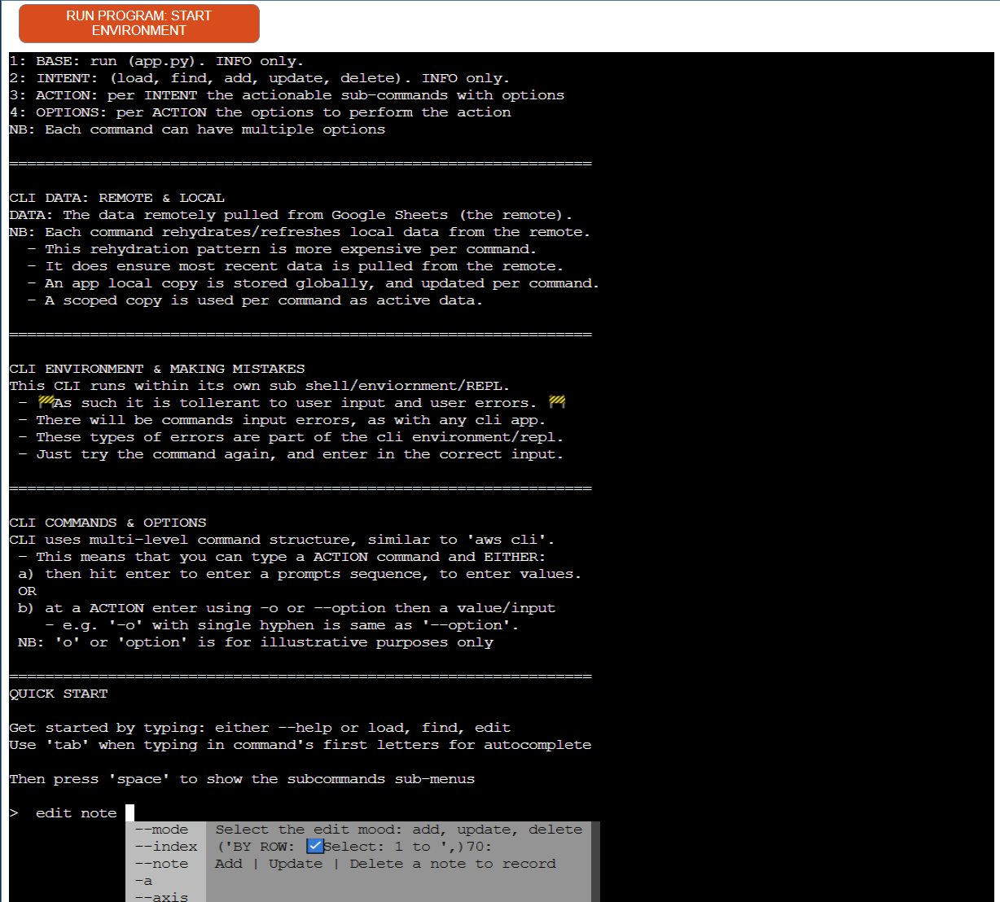<br>
`Screenshot 0: Overall Impression: Tablet and Laptop View`

---

#### 6.2.1 [Initialisation - Page Load - Landing Page](#feature-intialise) <small><sup>✅</sup></small>

- These screenshots are the first vieẇ for the user
- Note that the supporting text is kept to 80 cols for readability of blocks of text. 

---

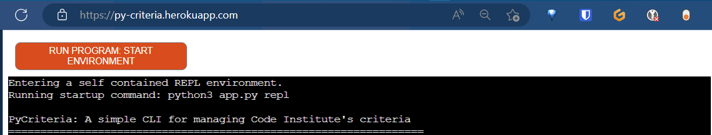<br>
`Screenshot 1: Top of Window: Entering the REPL`

- Informs of high level context and gives awareness.

---

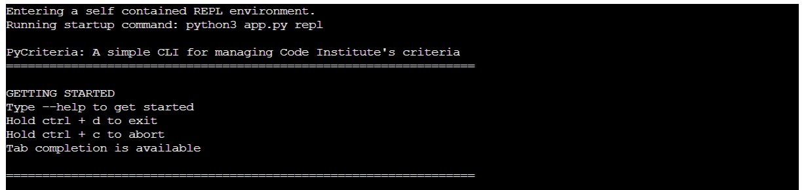<br>
`Screenshot 2: Getting Started`

- Informs user of optimal keyboard controls and command to enter.
- Useful for navigation of the CLI app in this REPL environment.

---

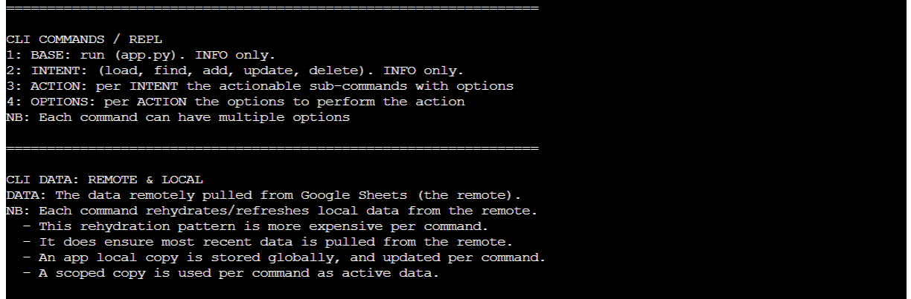<br>
`Screenshot 3: CLI Structure & CLI Data`

- Informs of the architecture and design behind the CLI

---

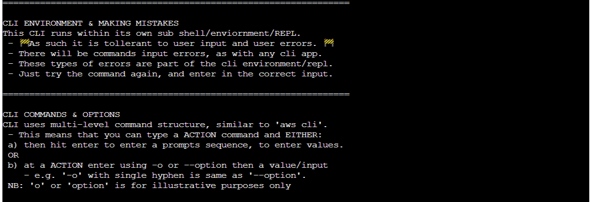<br>
`Screenshot 4: CLI Environment, Commands & Options`

- Informs how the environment is fault tollerant and handles user mistakes.
- Informs user of how to use the command & options in their various dual uses.

---

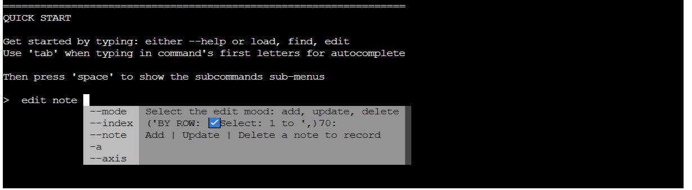<br>
`Screenshot 5: Quick Start & Autocomplete of Commands and Options`

- After all that introduction text, a quick refresher start guide to get the user going.
- This also shows the *autocomplete features* of the REPL for `options` under the `--option` and their short inline help text.
  - `space` starts the drop down menu for autocomplete for each of the `Intents`, `Actions`, and inline `Options`
  - Start typing the display item's name/label/prefix first letter.
  - `tab` completes the started displayed item, starting with the first letter/symbol of the command or option.
  - `enter`after the `Action` enters into a prompt sequence for value entry
  - Typing the relevant `--option` on the same line as `Intent Action`, e.g. edit note, does the same execpt that values follow the `--option` and `space` between option and value.


---
0
#### 6.2.2 [Autocomplete & Navigation](#feature-autocomplete) <small><sup>✅</sup></small>

> - Inherent in the design of the REPL, from [Click's Contibs](https://click.palletsprojects.com/en/8.1.x/contrib/) experiemental [R&G GitHub](https://github.com/click-contrib/), generated by the library [click_repl](https://github.com/click-contrib/click-repl), is the ability to use autocomplete.<br>
> > - *It was an automagic suprise, undocumented, feature that the author leveraged in his design.*
> - Combined in a nested command structure: *Base* > *Intent* > *Action*, it builds an automagic menu structure with a visual artefact of a selectable (Up & down menu).

- Are no screenshots per se, however each Feature Screenshots will demonstrate this inherent feature in action as it is common to all parts of moving and navigation the nested command structure.

#### 6.2.3 [Clear the Screen](#feature-clear-screen) <small><sup>✅</sup></small>

> Common: Clear commands are common to many cli, useful for when the user wants to start over from the previous context or just reset the `stdout` or `stderr` stream display.

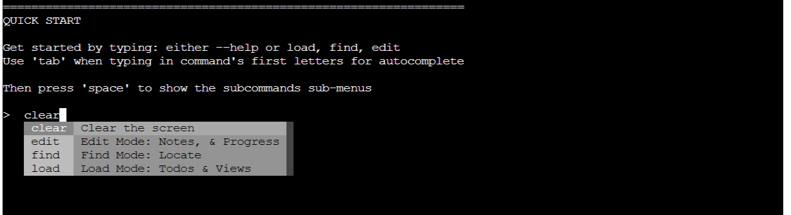<br>
`Screendshot 6.1: Clear command in autocomplete drop down selection`

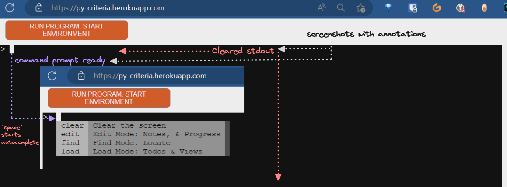<br>
`Screendshot 6.2: Clear command after clearing the screen`

- Shows before and after of command selection, and hitting `space` to popup the `autocomplete menu`

---

### 6.2.4 [Loading Mode | Load Mode](#feature-loading-mode)  <small><sup>✅</sup></small>

> - <ins>**Load Mode**</ins>: Displays the bulk of the CLI data in one view.<br> 
>     - <ins>Sub Views</ins> for each ACTION slice up the number of columns, so they fit in the CLI's web terminal width.<br>
>   - The source data is 15 columns wide, and is data dense, so sub views and partitioning of actions aids in this implemention of this design constraint.
> - Aliases for this are: `Reading Mode`, `Browse Mode` and `Bulk Display Mode`

<br>


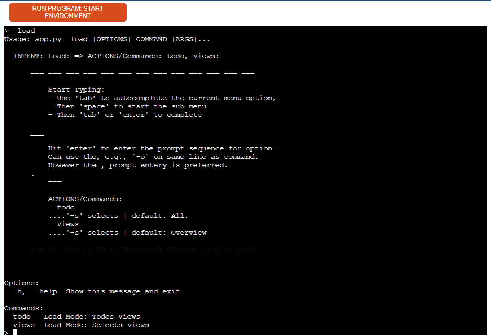<br>
`Screendshot 7.1: Load + presses enter immediately for Help`

- This displays the man page/help for the Load Intent. 
- The function and format is an inbuilt part of Click's command and help features.
- The text is used from the docstrings of the command, and is author generated.

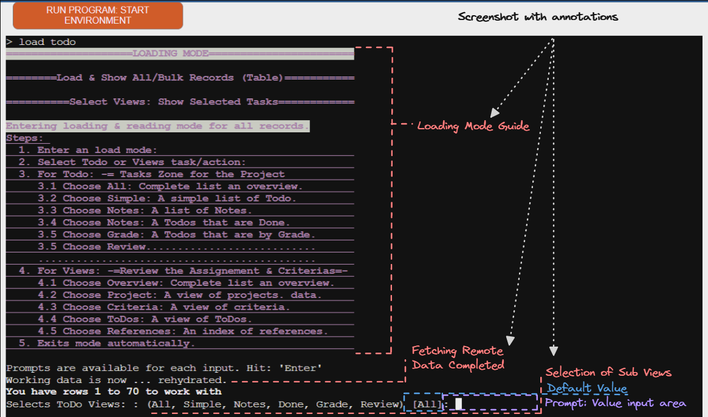<br>
`Screenshot 7.2: Load Todo for Todo View prompt and Sub View selection`

- Loading Mode user guide displays on each ACTION + `enter`
- See annotations for more details

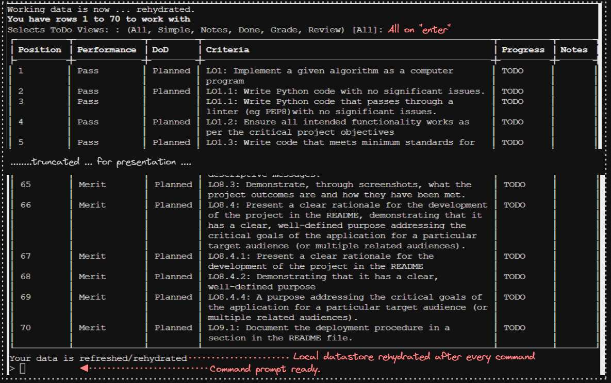<br>
`Screenshot 7.3: Load Todo's prompt value entry: All i.e. the default view`

<br>
`Screenshot 7.4: Load Todo's single line flag value entry, with auto complete`

- Loading Mode `All` subview dataset for reference.
- <ins>Input & Output for 7.3: *Prompted Value Entry*</ins>:
  1. `load` `todo` + user hits `enter`.
  2. Prompt: with default value + user hits `enter`
  3. Prompt: User can input, typing to select: `All`, `Simple`, `Notes`, `Done`, `Grade`, `Review` 
  4. User is not allowed to enter a non listed value
  5. If so, a Click.command level's soft error, not program traceback, shows that an invalid value was used.
  6. User trys again at the command ready prompt.
- <ins>Input alternate for 7.4: *Single Line Flag Value Entry*</ins>:
  1. Instead of user hitting enter, user can type `space` + `--` and the option name
     - e.g `load todo --selects`
  2. Then user enters in one of these values immediate after `--selects` + hits `space`:
     - e.g. `All`, `Simple`, `Notes`, `Done`, `Grade`, `Review` 
  3. Then user hits `enter` to complete the command.
  4. Same output.
  5. Same user mistake handling.
- Shows all 70 rows
- See annotations for more details

> These two **Input and Output Patterns (i.e. `7.3`, & `7.4`)** repeats for all subsequent ACTIONS, just with more prompts and selection choices to make. So only highlights of difference will be pointed to.

### 6.2.5 [Finding | Find Mode](#feature-finding-mode)

- 

### 6.2.6 [Editing | Edit Mode](#feature-editing-mode)

- 

### 6.3 [User Acceptance](#user_acceptance_testing)

#### 6.3.1 [Participants and Controls](#feature-actor-controls) <small><sup>✅</sup></small>

#### 6.3.1.1 [Actors](#feature-actors) <small><sup>✅</sup></small>

 Actor | Description 
 ---: | :--------------------------
CLI (app):  | The app, as an algorithm, without user interaction.
Google:  | The remote host/API providers/Data respoitory 
REPL | External Library (Cick REPL) functions, not authored
User | User for the CLI who interfaces/uses the commands/subcommands

#### 6.3.1.2 [Controls](#feature-controls) <small><sup>✅</sup></small>

- The user is presented with a application level custom prompt (i.e. the *main prompt*) in an *application level REPL* environment. 
- The **main prompt** is configured to autocomplete the users input and ...
  - Each command/sub command is autopopulated in the auto complete, by the line/function in app.py: `register_repl(run)` which is `from click_repl import register_repl` library.
  - **Command Controls**:
    - **`tab`** - completes the users typing of the auto populated command per level
    - **`space`** - function testing has found that hiting space bar after an autocomplete is the safest trigger to the next level of autocomplete
    - **Up, down arrows** help the user navigate the autocomplete sub menu choices in the terminal window.
- The main prompt matches all the commands of the all from the 2nd level (the INTENT) commands (i.e inert parent containers), and subseqently, 3rd level (the ACTION) sub commands. 
- Each **sub command** has configured *options*, that either take in *flagged option/value* pairs as input or *prompted option/value* pairs as input (hitting enter each time). 
  1. For <ins>single line `option/value`</ins>, or *`flagged option/value`*: 
     - Each options follows 1 of 2 formats: 
       1. `-o <value>`, which is a a shortcut variant of ...  
       2.  `--option  <value>`, where option is the name of the option linked to the subcommand. 
    - Each option either takes in a value or the autocomplete if the user does not hit enter and stays on a command line, then hits enter.
  2.  For <ins>prompted option/value pairs</ins>, like the above:
      - Once the user presses enter after selecting a sub command, and if configured, the command enters a sub-prompt
      - Each option is then listed in sequence, awaiting the user inputed value
      - The user presses enter to continue, the last hit enter runs the sub0command,
- Running a subcommand, i.e. an ACTION, executes some or all of the following:
  1. Any effects for the sub command algorithim,
  2. Any command level internal prompts
  3. Any command level confirmation (prompts): y/N.
  4. Output to the stdout according to the command INTENT/ACTION i.e. its TASK. 


#### 6.3.2 [Feature Acceptance Testing](#feature-testing) 

|    Epic | User Story |                            Feature |                                                                                         Actions | Actor(s)        | Effects or Absence of Side Effects                                                 | Outcome                                                            | Acceptance, Date |
| ------: | :--------- | ---------------------------------: | ----------------------------------------------------------------------------------------------: | :-------------- | :--------------------------------------------------------------------------------- | :----------------------------------------------------------------- | :--------------- |
| 1. Init | 1.1/1.1.1  |                  Connect to remote |                                                             Automated, On Program Run/init/main | CLI/Google      | No Authetentication Error, Silent                                                  | Authorised                                                         |                  |
| 1. Init | 1.1.2      |                         Fetch Data |                                                             Automated, On Program Run/init/main | CLI/Google      | No Connection Error, Silent                                                        | File access, data loaded                                           |                  |
| 1. Init | 1.3        |          Load to CLI/Local Dataset |                                                             Automated, On Program Run/init/main | CLI             | Silent, no visual feedback expected, no errors                                     | Main prompt blinking                                               |                  |
|  2. Cmd | 2.1        |                   CLI autocomplete |      Autocomplete, auto populate command labels, as a selectable, and key input driven CLI menu | REPL/User       | Display CLI commands as only accepted choices                                      | List available commmands                                           |                  |
|  2. Cmd | 2.2        |                           CLI Help |                              Options to display help text for each command and option with ease | CLI/REPL/User   | Display builtin help for the command's option                                      | List short descriptions                                            |                  |
|  2. Cmd | 2.2.1      |                    Commands --help |                                          Runs at BASE level, on star, or when User types --help | CLI/User        | Display builtin help for the linked, nested commands                               | List short descriptions                                            |                  |
|  2. Cmd | 2.2.1      |                   Per options help | When a user is typing an option, the autocomplete <br> may show the `help text` for that option | REPL/User       | Display builtin help for the command's option                                      | List short descriptions                                            |                  |
| 3. Load | 3.1        |        Intent: Load  & "Load Mode" | Loads, and affirms connectivity, the bulk of the data in whole table or selected views of table | User, CLI       | Display a total bulk or filtered view (table) of data                              | `Nothing to do`, bar `--help` and the sub commands help text       |                  |
| 3. Load | 3.2        |        Command/Action: Load > ToDo |                                              User selects a the TODO subcommand, and/or options | User            | Display a filtered view (table) of Todo                                            | Displays a filtered subset of columns related to TODO-ing tasks    |                  |
| 3. Load | 3.3        |       Command/Action: Load > Views |                                      User selects a the VIEW subcommand, and or display options | User            | Display a filtered view (table) other Views                                        | Displays a filtered subset of columns of predefIned VIEWS          |                  |
| 4. Find | 4.1        |         Intent: Find & "Find Mode" |                                  User uses a FIND INTENT/ACTION pair to find individual records | User            | Display a located individual record(s0) by index etc                               | `Nothing to do`, bar `--help` and the sub commands help text       |                  |
| 4. Find | 4.2        |      Command/Action: Find > Locate |                                          User locates a record and it is display in card format | User            | Display a individual record as a card view/layout                                  | After a prompted set of values, displays a indvividual record card |                  |
| 4. Find | 4.2.1      |  Command/Action: Locate > By Index |      User locates a record by a known record ident/numerical value, in the range of the dataset | User            | Display a individual record as a card view/layout                                  | Displays a individual record card, when a location id is known     |                  |
| 5. Edit | 5.1        |         Intent: Edit & "Edit Mode" |                                                 User uses Edit INTENT/ACTION to enter edit mode | User            | Enters an edit mode, uses locate, displays/compares record, saves record to remote | `Nothing to do`, bar `--help` and the sub commands help text       |                  |
| 5. Edit | 5.1.1      |          "Edit Mode" & Find/Locate |                                        Edit Mode reuses Locate (4.2,4.2.1) for each EDIT ACTION | CLI             | Locates an individual record(s) by index, displays the found/current/wanted record | Locates, silently, and builds the a record to be edited            |                  |
| 5. Edit | 5.2.1      |    Command/Action: Edit > Add Note |                                                      User selects Add Note to insert a new note | User            | Locates a note, inserts new value, compares old/new, saves (54) changes            | On locating, displays a current and edited record, with value      |                  |
| 5. Edit | 5.2.2      | Command/Action: Edit > Update Note |                                           User selects Add Note to append more to existing note | User            | Locates a note, appends value, compares old/new, saves (5.4) changes               | On locating, displays a current and edited record, with value      |                  |
| 5. Edit | 5.2.3      | Command/Action: Edit > Delete Note |                                          User selects Add Note to clear all of an existing note | User            | Locates a note, clears value, compares old/new, saves (5.4) changes                | On locating, displays a current and edited record, with value      |                  |
| 5. Edit | 5.3        | Command/Action: Edit > Toggle Todo |                    User selects a choice (Todo, WIP, Done) to toggle teh field's PROGRESS state | User            | Locates a note, toggles value, compares old/new, saves (5.4) changes               | On locating, displays a current and edited record, with value      |                  |
| 5. Edit | 5.4        | SharedFunction: Edit > Save Change |           Edit Mode/Shared, commits saved changed to remote, in common with Add, Update, Delete | User/CLI/Google | User confirmation, data transforms and opens connection to update remote datatset  | Finally, the user is asked to confirm saving the record to remote  |                  |

----
> |
----

## 7.0 [Reliability](#qa) <small><sup>✅</sup></small>

### 7.1 [Testing & Validation](#testing) <small><sup>✅</sup></small>

### 7.2 [Static Analysis](#static) <small><sup>✅</sup></small>

### 7.2.1 [Basic Linting: AutoPep8](#pep8-ci) 

> Code Institute very own autopep8 validator: https://pep8ci.herokuapp.com/

File* |   Date   |                                     Why no fix                                      |        Issue        | Code  |           State           | Links
-----:|:--------:|:----------------------------------------------------------------------------:|:-------------------:|:-----:|:-------------------------:|:-----
All | OnGoing  |                                      2                                       | trailing-whitespace | C0303 |         disabled          | Non Critical
app.py | 23-05-05 | Non Critical, typically lines between functions</br> Fixed in pyproject.toml |     blank line <br/>contains whitespace    | W293  | Passing <br/>with ignored | _
controller.py | 23-05-05| Non Critical, typically lines between functions</br> Fixed in pyproject.toml |     blank line <br/>contains whitespace    | W293  | Passing <br/>with ignored | _
apptypes.py | 23-05-05 | Non Critical, typically lines between functions</br> Fixed in pyproject.toml |     blank line <br/>contains whitespace    | W293  |          Passing          | _
commands.py | 23-05-05 | Non Critical, typically lines between functions</br> Fixed in pyproject.toml |     blank line <br/>contains whitespace    | W293  | Passing <br/>with ignored | _
exceptions.py | 23-05-05 | Non Critical, typically lines between functions</br> Fixed in pyproject.toml |     blank line <br/>contains whitespace    | W293  |       Passing <br/>with ignored       | _
settings.py | 23-05-05 | Non Critical, typically lines between functions</br> Fixed in pyproject.toml |     blank line <br/>contains whitespace    | W293  |       Passing <br/>with ignored        |_
sidecar.py | 23-05-05 | Non Critical, typically lines between functions</br> Fixed in pyproject.toml |     blank line <br/>contains whitespace    | W293  |     Passing <br/>with ignored        | -

### 7.2.2 [Code Quality](#quality) <small><sup>✅</sup></small>

#### 7.2.1.1 [Ruff](#lint-ruff) 

> See `.pyproject.toml` for configuration and evaluation of configuration.

- **Summary**
    - `ruff check .` when in the root of the project,
    - run via the terminal and after `venv/Scripts/activate.ps1` is activated
    - Ruff mirrors Flake8's rule code system, in which each rule code consists of a one-to-three letter prefix, followed by three digits

- **Possible Linters**: [Ruff Rule](https://beta.ruff.rs/docs/rules/)
  `ruff linter` from the terminal in the root of the project.
  > Ruff supports over 500 lint rules, many of which are inspired by popular
  > ... tools like Flake8, isort, pyupgrade, and others. Regardless of the rule's origin,
  > ... Ruff re-implements every rule in Rust as a first-party feature.

 ````
  PS D:\Code\Code Institute\PyCriteria> ruff linter          
   F Pyflakes   
 E/W pycodestyle
 C90 mccabe
   I isort
   N pep8-naming
   D pydocstyle
  UP pyupgrade
 YTT flake8-2020
 ANN flake8-annotations
   S flake8-bandit
 BLE flake8-blind-except
 FBT flake8-boolean-trap
   B flake8-bugbear
   A flake8-builtins
 COM flake8-commas
  C4 flake8-comprehensions
 DTZ flake8-datetimez
 T10 flake8-debugger
  DJ flake8-django
  EM flake8-errmsg
 EXE flake8-executable
 ISC flake8-implicit-str-concat
 ICN flake8-import-conventions
   G flake8-logging-format
 INP flake8-no-pep420
 PIE flake8-pie
 T20 flake8-print
 PYI flake8-pyi
  PT flake8-pytest-style
   Q flake8-quotes
 RSE flake8-raise
 RET flake8-return
 SLF flake8-self
 SIM flake8-simplify
 TID flake8-tidy-imports
 TCH flake8-type-checking
 INT flake8-gettext
 ARG flake8-unused-arguments
 PTH flake8-use-pathlib
 ERA eradicate
  PD pandas-vet
 PGH pygrep-hooks
  PL Pylint
 TRY tryceratops
 NPY NumPy-specific rules
 RUF Ruff-specific rules

 ````

#### 7.2.1.2 [Pylint](#lint-pylint) 

> Integrated into PyCharm, so this is the defacto problem matcher for the IDE.
> Disabled: `pylint: disable=` in the code base hint at non-critical or intentional code hot spots

*File* |   Date   |       LN       |        Issue        | Code  |  State   | Note
-----:|:--------:|:--------------:|:-------------------:|:-----:|:--------:|:-----
All | OnGoing  |       2        | trailing-whitespace | C0303 | disabled | Non Critical
controller.py | 23-05-05 | 90,104,228,234 |  unnecessary-pass   | C0114 | disabled | Temporary
settings.py | 23-05-05 |     26-42      |    invalid-name     | C0103 | disabled | Using custom convention <br> Using upper case to flag program variables<br> Setting CONSTANTS
settings.py | 23-05-05 |     19,49      |    too-few-public-methods     | R0903 | disabled | Setting Classes
settings.py | 23-05-05 |     19,49      |    too-many-instance-attributes     | R0902 | disabled | Setting Classes
connection.py | 23-05-05 |     26-36      |    invalid-name     | C0103  | disabled | as per settings.py, CONSTANTS

#### 7.2.1.3 [MyPy](#lint-mypy)

***Status***

Date |  Status 
-----:|:---------: 
2023.07.05 | Passing

> Integrated into PyCharm, by 3rd Party Plugin:
> Invoke: ``dmypy run -- --check-untyped-defs --follow-imports=error --exclude /venv/ .``

File |   Date    | LN | Issue | Fix   |  State  | Note
-----------------:|:---------:|:--:|:-----:|:-----:|:-------:|:---
`settings.pg` | 23-05-05  | 1 | assignment | changed type assign | Passing | --

### 7.3 [Code Integration](#code-integration) <small><sup>✅</sup></small>

> Version control use and configuration for commits and pull requests

### 7.3.1 [Commit Strategy | Style](#vcs-commits) <small><sup>✅</sup></small>

- The author found that he deviated from this common practice and he adopted one that suited his own efforts and working practices.

1. Committed when his own local testing and or linting practice is completed and all checked were passing locally on a functional level (i.e. local results were good).
2. New features were added, mutated or removed (using a commit as a changelog)
3. Pushing untested changes, thought nominally well linted previous, to the main for a pull request to the heroku branch and deployment to the Heroku CI/CD pipeline.

- Though this practice did not hold when either there was a mentor meeting and a code base was for review and then all was commited.

### 7.3.2 [Pull Request Checks](#pr-checks) <small><sup>✅</sup></small>

#### 7.3.2.1 [Check Providers](#CO-providers) <small><sup>✅</sup></small>

- Synx: security/snyk (iPoetDev) — https://snyk.io/
- Code Review Doctor: https://github.com/apps/code-review-doctor
- Codecov: Codecov provides highly integrated tools to group, merge, archive and compare coverage reports.
- codebeat: https://codebeat.co/
- CodeFactor: https://www.codefactor.io/
- Code scanning results / CodeQL: https://github.com/settings/security_analysis
    - Dependency graph: Understand your dependencies. ``Enable``
    - Dependabot: Keep your dependencies secure and up-to-date ``Enable``
        - Dependabot Alert: Receive alerts for vulnerabilities that affect your dependencies. ``Enable``
        - Dependabot security updates: Automatically open pull requests for security updates. ``Enable``
    - Secret scanning: Receive alerts on GitHub for detected secrets, keys, or other tokens. ``Enable``

----
> |
----

## 8.0 [Deploy](#deploy)

### 8.1 [Deployment](#deployment) <small><sup>✅</sup></small>

#### 8.1.1 [Heroku Create App](#heroku) <small><sup>✅</sup></small>

- 1: Login to Heroku, and verify and MFA authenticate
- 2: Create a new app.
  
- 3: Choose a deployment method. ``GitHub``
  
- 4: Connect to GitHub and search for the repository: ``PyCriteria``
  
- 5: Connect to chosen Repository and verify
  
  
  - NOTE: ___ADR Decision___: Decide the selection of the branch to deploy to:
    - Decision: ``heroku``, as a protected branch
        - Use **Trunk based development** from the ``main`` branch to ``heroku`` branch
        - Commmit Style: Push to ``main`` for development codebase.
        - Once the GitHub CI Apps (above) have passed all checks.
        - Tag Code ready for deployment: Push to ``heroku``
        - Deployment is automated via Heroku's app deployment
        - By not having automated deployment on ```main```, there is no failed deployment
          noise on ``main`` branch and in the logs.
- 6: Add buildpacks in correct order, as order sensitive, for good first run
    - Use built-in buildpacks for Node.js and Python
        - 1st: `heroku/nodejs`
        - 2nd: `heroku/python`
- 7: Config Vars
- 8: On Github, deploy to Heroku by PullRequest
  


#### 8.1.1.1 [App Information](#heroku-app) <small><sup>✅</sup></small>

Name | Region | Stack | Framework | Slug Size | ConfigVars | Buildpacks | SSL Certs | Repo | Local Git
------------:|:-------|:----------|:----------|:-----------|:-----------|:--------------|:----------|:--------------------|:--------
py-criteria | Europe | heroku-22 | Python | 30/500 MiB | In Use | heroku/python | None | iPoetDev/PyCriteria |https://git.heroku.com/py-criteria.git

#### 8.2.2 [Heroku Branch Deployment](#heroku-git) <small><sup>✅</sup></small>

1. Pull Request from ``main`` to ``heroku`` branch for deployment
2. Protect ``heroku`` branch from changes or having anything pushed
3. Merge from ``main`` to ``heroku`` branch for each release
4. From `raw/new code` -> `linted code` -> `manually tested` -> `locally running` -> `PR#1` -> `Merge to Heroku` ->
   `Heroku Automated`

**A1: Heroku Release Flow**

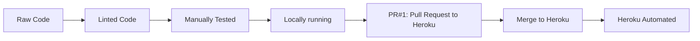
```mermaid
flowchart LR
	A[Raw Code] --> B[Linted Code]
	B --> C[Manually Tested]
	C --> D[Locally running]
	D --> E[PR#1: Pull Request to Heroku]
	E --> F[Merge to Heroku]
	F --> G[Heroku Automated]
```

**A2: Heroku Commit Flow**

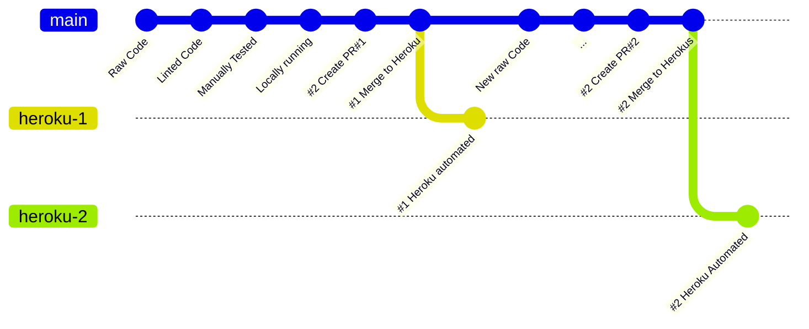
```mermaid
gitGraph:
	commit id: "Raw Code"
	commit id: "Linted Code"
	commit id: "Manually Tested"
	commit id: "Locally running"
	commit id: "#2 Create PR#1"
	commit id: "#1 Merge to Heroku"
	branch heroku-1
	commit id: "#1 Heroku automated"
	checkout main
	commit id: "New raw Code"
	commit id: "..."
	commit id: "#2 Create PR#2"
	commit id: "#2 Merge to Herokus"
	branch heroku-2
	commit id: "#2 Heroku Automated"
```

#### 8.2.2.1 [Heroku Deployments](#heroku-deploy) <small><sup>✅</sup></small>

- Must have buildpacks installed in the correct order
    1. `heroku/nodejs`
    2. `heroku/python`

#### 8.2.2.2 [Heroku CLI Logs](#eroku-logs) <small><sup>✅</sup></small>

> CLI Documentation: [Heroku CLI](https://devcenter.heroku.com/articles/heroku-cli)

```bash
heroku logs --app=py-criteria --tail
```

Other useful runners

```bash
heroku option --app=py-criteria arguement
```

#### 8.2.3 [Repository Service](#repo-vcs) <small><sup>✅</sup></small>

- [GitHub.com](https://www.github.com) is the chosen remote code repository service being used.

User | Profile | Repo | Link                                   | Visibility | Issues
----------:| :--- | :--- |:---------------------------------------|:--- |:---
@iPoetDev | @iPoetDev | PyCriteria | https://github.com/iPoetDev/PyCriteria | Public | Issues

#### 8.2.4 [Local Git Service / IDE](#local-git) <small><sup>✅</sup></small>

- PyCharm configured with GitHub account for Local development environment.
- Utilized a modified/reduced Changelog format to document the changes, a-la, Keep a Changelog.
    - Intsead of using changelog.md, I used PyCharm's peristence of commit messages as a changelog/planning tool, intentionally.
    - Directly in the commit messages.
    - Reduced efforts by not maintaining the ``changelog.md``, which is abandoned.
- Mostly adhered to Semantic Versioning approach.
    - Minor adjustment was to put a double-digit index for each separate commit if several occurred on one day.

#### 8.2.5 [Deployment Environment](#deploy-env) <small><sup>✅</sup></small>

- Heroku is the cloud environment for deployment:
- Deploy a static web page off every commit.
- Once the commit is built, then deploys the new website and pushes to hosted domain URI.
- Heroku is the hosted domain URI and service.
- The final URI is:
    - **Plain Text**:
      ``` https://py-criteria.herokuapp.com/ ```
    - **Link**: [https://py-criteria.herokuapp.com/](https://py-criteria.herokuapp.com/ "PyCriteria: https://py-criteria.
      herokuapp.com/")

----
> |
----

## 9.0 [Assessment](#assessment) <small><small><sup>✅</sup></small></small>

### 9.1 [References & Acknowledgements](#references-acknowledgements) <small><small><sup>✅</sup></small></small>

#### 9.1.1 [AI &amp; Author](#ai-author) <small><sup>✅</sup></small>

> As per above, all references to PerplexityAI is listed here.

File | Line No | Use | PerplexityAI Link
---:|----:|----:|---
app.py | 805 |has_dataframe | www.perplexity.ai/searches/a2f9c214-11e8-4f7d-bf67-72bfe08126de?s=c
app.py | 1184 | addsinglenotes | https://www.perplexity.ai/search/a8d503cb-8aec-489a-8cf5-7f3e5b573cb7?s=c
app.py | 1470 | Click_repl | www.perplexity.ai/search/085c28b9-d6e8-4ea2-8234-783d7f1a054c?s=c

#### 9.1.2 [References](#references) <small><sup>✅</sup></small>

- **<small>DATA SOURCE</small>** | CodeInstitute |: Project Three: Diploma in Full Stack Software Development, Assessments Guide
  https://code-institute-org.github.io/5P-Assessments-Handbook/portfolio3-prelims.html => DataSourceFile of DataModel

### 9.2 [Credits](#credits) <small><small><sup>✅</sup></small></small>

> Documentation | Articles | Tutorials | Resources | Books | Podcasts

#### 9.2.1 [Guides, Books, Articles](#guides) <small><sup>✅</sup></small>

- **<small>BLOG</small>** | [Maruised Brg's article on Advanced CLI with Python and ClI](https://mauricebrg.com/article/2020/08/advanced_cli_structures_with_python_and_click.html)  
- **<small>BOOKS</small>** | Jason C. McDonald: Dead Simple Python: https://nostarch.com/dead-simple-python (Kindle)
- **<small>PODCAST</small>** | [Talk Python podcast, episode #366, titled: ""Terminal magic"" with Rich and Textual"](https://talkpython.fm/episodes/show/336/terminal-magic-with-rich-and-textual)
- **<small>PODCAST</small>** | PythonBytes: https://pythonbytes.fm/
- **<small>PODCAST</small>** | Talk Python To Me : https://talkpython.fm/
- **<small>TUTORIAL</small>** | Leodanis Pozo Ramos: Build a Command-Line To-Do App With Python and Typer : https://realpython.com/python-typer-cli/
- **<small>WALKTHROUGH</small>** | CodeInstitutes: LoveSandwiches: https://learn.codeinstitute.net/courses/course-v1:CodeInstitute+LS101+2021_T1/courseware/293ee9d8ff3542d3b877137ed81b9a5b/58d3e90f9a2043908c62f31e51c15deb/

#### 9.2.2 [Videos](#videos) <small><sup>✅</sup></small>

> YouTube | Online

- **<small>CLICK</small>** | FancyGUI | Creating a simple CLI with Python Click: https://www.youtube.com/watch?v=GnSKhetBa48&t=9s
- **<small>CLICK</small>**  | JCharisTech | Python Click Tutorials- Intro and Options (Build A Command Line Application with Click): https://www.youtube.com/watch?v=riQd3HNbaDk&pp=ygUFY2xpY2s%3D
- **<small>CLICK</small>**  | NeuralNine | Professional CLI Applications with Click: https://www.youtube.com/watch?v=vm9tOamPkeQ&pp=ygUFY2xpY2s%3D
- **<small>RUFF</small>**: PyCharm by JetBrains | Ruff: Faster Python Linting With Rust: https://www.youtube.com/watch?v=jeoL4qsSLbE&t=4229s

#### 9.2.3 [Library Documentation](#documentation) <small><sup>✅</sup></small>

> **CODE**

- **Click**: https://click.palletsprojects.com/en/8.0.x/
- **GSpread with Panda**: https://docs.gspread.org/en/latest/user-guide.html#using-gspread-with-pandas
- **GSpread**: https://docs.gspread.org/en/latest/
- **Pandas**: https://pandas.pydata.org/docs/getting_started/index.html
- **Prompt**: http://python-prompt-toolkit.readthedocs.io/en/stable/pages/reference.html?prompt_toolkit.shortcuts.Prompt#prompt_toolkit.shortcuts.Prompt
- **Rich**: https://rich.readthedocs.io/en/stable/index.html

> **TOOLS**

- **Ruff**: https://beta.ruff.rs/docs/
- **PyLint**: https://pylint.readthedocs.io/en/latest/index.html
- **MyPy**: https://mypy.readthedocs.io/en/stable/index.html

#### 9.2.4 [GitHub](#repos-github) <small><sup>✅</sup></small>

> The author spends time and lot of time in the source code of 3rd party libraries.

> **CODE**

- **Click's REPL**: https://github.com/click-contrib/click-repl
- **Rich**: https://github.com/Textualize/rich
- **MauriceBrg/mauricebrg.com-projects**: https://github.com/MauriceBrg/mauricebrg.com-projects/blob/master/click-getting-started/multi_level_cli.py
- 
----
> |
----
