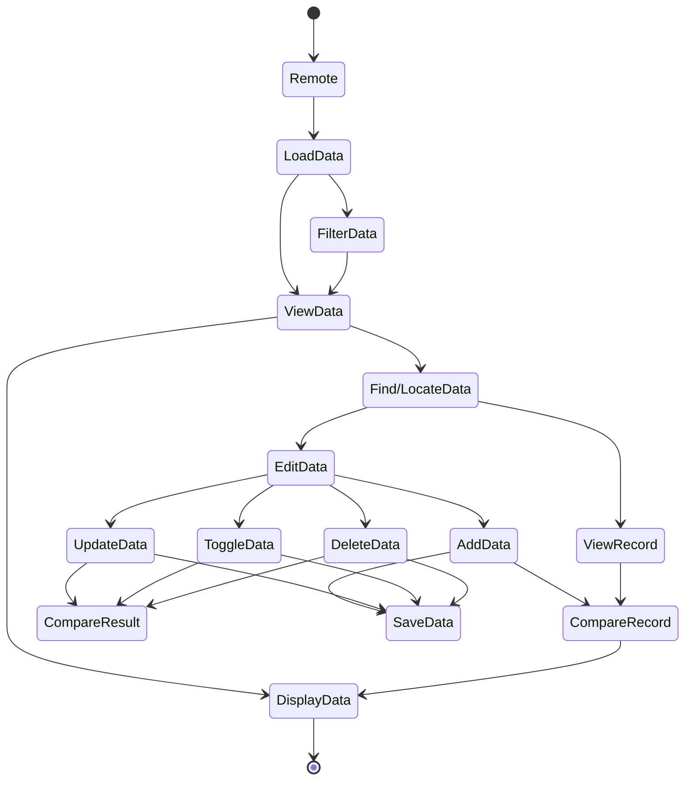
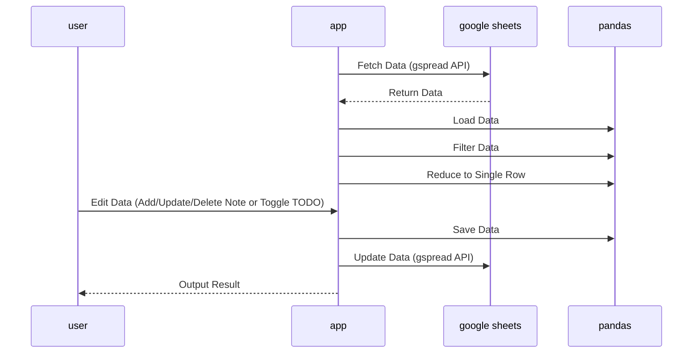
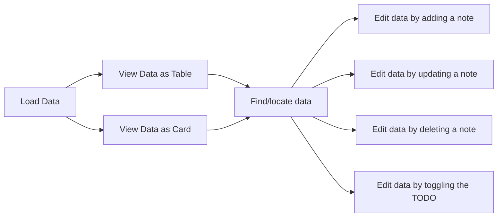
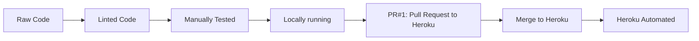
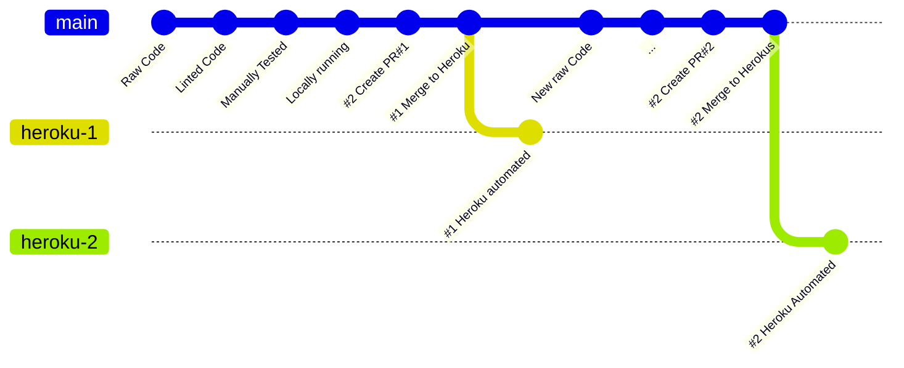

# Project Criteria

## 1.0 [Introduction](#introduction)

- Data-centric command line interfaces are increasingly popular, for a wide set of use cases and implementations to
  model the architecture and design against these use cases; particularly in high speed trading and larger
  datamodeling environments.
- In these use cases, performances is everything and using an non-graphical interface is more optimal than a GUI driven one.
- This is a simple example of a command line interface that models after the popular aws cli by being command and
  options driven over an nested command structure to manipulate the data in a google sheets as a simple Project
  Management format managing Code Institute's own project assignments and criteria.
  This app will provide users with:

1. Ability to Load spreadsheet data from Google sheets as a two dimensional view.
2. The view of data is a replica of the data in a table and individual cards format.
3. The user can find/locate, by row identifier, the row of data.
4. The user can then edit the row's data, by one of the 4 following tasks:
    1. Add a note to the record, at the location
    2. Update the note in the record
    3. Delete the note in the record, by clearing the location
    4. Toggle to TODO in the individual records

## 1.1 App

[Live App Here](https://py-criteria.herokuapp.com/)

## 1.2. Screenshots

<!-- todo #2: add image link-->


----
----

## 2.0 [Plan](#plan)

### 2.1 [User Experience](#ux)

- Any user, regardlesss of experience, should be intuitively started using the autocompleted command prompts, without
  fear of entering the wrong command or option, and freeze in a panic of *"oh no, what do I do now?"* or *"what have I
  just done"* when they start using the command and nagivatingly that long fidelity expereince that are common line
  interfaces
    - I.e., For instance, most non-technical users fear and avoid using CLI apps if they cannot help it for these very
      reasons below.
    - E.g. The lack of feedback from the immediacy of their actions and the lack of a clear path to recover
      from these actions.
    - GUI applications tend to be more forgiving and givings inexperienced users more comfortable and feeadback in
      what they are doing and how to recover from mistakes.
- Any user, regardless of experience, should be able to use the application without having to read the documentation
  or help files.
- However, the user should be able to access the help files and documentation, if they need to, in the cli in the
  context of the command prompt. Say by the, for example, entering '--help', or '-h' as an option to the command prompt.
- The CLI commands and options should allow the user to complete their objectives as simply as possible.
    - These tasks are be to:
      A. Load the data from the remote source
    - B. Select different views of the data, and refining the quantity of the views, either
        1. By reducing the number of columns in the view - selecting from options of a preset views of columns
        2. By reducing the number of rows, due to the constraints of the terminal window, so to page (i.e., to browser)
           across larger data sets.
    - C. Find the data by row identifier, as gleamed from their viewing of the larger data set.
        1. Locating by row identifier for an exact match.
        2. [Future feature] Searching by querying all the data in the data set for a partial match or exact match.
        3. [Future feature] Filtering data viewed in the data set for a partial match or exact match.
    - D. Edit the data in the row, by one of the 4 following tasks:
        1. Add a note to the record, at the location
        2. Update the note in the record
        3. Delete the note in the record, by clearing the location
        4. Toggle to TODO in the individual records
- The CLI should allow the user to manage their projects from the CLI, while they are developing other CLI
  apps and, so can update their projects achievements by adding notes and checking off of TODOs per project learning
  objective and criteria.
- This CLI application only reached MVP level and therefore has potential for more development effort to be planned for.

### 2.2 [Audiences](#audiences)

> These audiences types are lofty and may be aspirational, but they are the target audiences for this application.
> And some are just for the memes, in a "drink your own champagne way".

- Developers looking to understand how to develop and design multiple levels nested command line interfaces.
- Data Scientists looking to understand how to extract, transform and load data from spreadsheets by CLI interfaces
- Code Institute students looking to understand user OOP as a design pattern for CLI applications, and how to
  implement it in Python.
- Code Institute assessors as potential clients and users / owners of the Project Criteria for Code Institute
  assigments; and as fun meme of using the Criteria data in ths project.
- Myself, the author of the project, keep me on track and on target for the project criteria and delivery of project.

### 2.3 [Requirements](#requirements)

#### 2.3.1 [Drivers](#driving-requirements)

- The requirments of this application were defined by the project criteria of
    1. [LO7.0] "... to manage, query and manipulate data ..." in a real-world domain.
    2. The adforementions realworld domain is the
       a. intersection of CLI design for inexperienced developers learning python.
       b. building familarity with common developer tools like AWS's CLI or GitHub's CLI or Heroku's CLI, all cli tools that Code Institute developers and students become to be familar with.
       c. .. and who are learning to manipulate datasets from a predefined source initially.
    3. Some developing a CREATE, READ, UPDATE, DELETE (CRUD) application for a dataset was the driver.
    4. Additionally developing ETL and Find/Located operations where also the drivers for the application's features.

#### 2.3.2 [Business Case](#business-requirements)

- The business case of this kind of application is to deomonate the utility, and RoI value add, of CLI
  applications for accessing remote data varied datasets from the command line, although this is only a MVP solution
  so it is bare bones and not fully featured.
- This was inspired by the listings to the creator of the *'**rich**' CLI python
  library* on [Talk Python podcast, episode #366, titled: ""Terminal magic"" with Rich and Textual"](https://talkpython.fm/episodes/show/366/terminal-magic-with-rich-and-textual)
- Additionallt, the design of the command line the user interfaces interactions was heavily influence the by
  [Maruised Brg's article on Advanced CLI with Python and ClI](https://mauricebrg.com/article/2020/08/advanced_cli_structures_with_python_and_click.html).
- The specific reference of Amazone 'aws cli' application was particularly interesting and very useful. It also demonstrates the business case of multi-commands CLIs and who the user targets audience is.

#### 2.3.3 [Data Requirements](#user-requirements)

- The datamodel comes from the very own project criteria for the Code Institute assigments.
- Here is the URI, which is behind a login page, https://learn.codeinstitute.net/courses/course-v1:CodeInstitute+PE_PAGP+2021_Q2/courseware/40cd7850a24d454795ec611831b06b77/980b1952a3a64898ab4010759bd0bd6a/
- A non login version of the data is available at CI's own github pages site: https://code-institute-org.github.io/5P-Assessments-Handbook/portfolio3-prelims.html
- Having had piror experience with breaking down the data model, the author did manaual extract and transformed it
  into a 15 columns (fields) by 70 items spreadsheet format.
  This is available here, under the Data tab, https://docs.google.com/spreadsheets/d/1qOPVOTm5oS9G0feggujXwzfo5TsD8yMxkdBfPTdpBm0/edit?usp=sharing
    - The following fields are native to the source data:
        - Performannce, alias for Grade, Pass, Merit (and Distinction, not included)
        - Tier (Learning Outcome label) for Top level
        - CriteriaGroup - The LOX indicator for the Learning Outcome grouping/ordering
        - Criteria (Learning Outcome text)
    - The following fields are dervied from the source data
        - Tier - Criterion (a sub part of a Learning Outcome, as many criteria make sense outcome)
        - TierPrefix - LC
        - TierDepth -: By ising a dotted notation of the depth of details in the criteria group, e.g., 1.1.1 for
          Criteria References (), you could atomicise the criteria group into its smallest constituent parts.
          i.e. Depth is how deep this breaks down is. Potentially useful for extracting data transformations
          operations on top of data without complicated analsysis. Is preformated.
        - LinkedRef(erences): Associate with references of all similar nature or overlapping contexts.
    - The following fields are author sourced
        - DoD, alias for Definition of Done: Thinking, this could be a plannning field. Alias for ToDo and ToDoFlag
        - CriteriaTopic: Author's own taxonmony for the categories of the criteria
        - Progression, alias for ToDo
        - ToDoFlag, alias for ToDo but in a programmatic sense of a boolean nature: 0 (ToDo) or 1 (Done)
        - RowID: To be deprecated. A datasets plot that googles sheet's row number, which is a +1 based index, as
          the header row are the field/column labels.
        - Position: A nonz-zero index identifyiers for the row, given that most datastructures are N-1 indexed,
          starting from zero position.

### 2.3.1 [User Stories](#user-stories)

- As a user, I want to be able to load data from a Google sheet.
- As a user, I want to be able to view data in a table and individual card format.
- As a user, I want to be able to find/locate a record by row identifier.
- As a user, I want to be able to edit a record by adding a note to the location.
- As a user, I want to be able to edit a record by updating the note in the location.
- As a user, I want to be able to edit a record by deleting the note in the location.
- As a user, I want to be able to edit a record by toggling the TODO in the individual records.

#### 2.4 [Future](#future-requirements)

In the future, this application could be extended to include:

1. Search and locate data by phrase or text search (down columns, and across rows).
2. Edit more than notes and to do, but also the other fields in the record.
3. Add new records to the spreadsheet by complete rows.
    - It must be noted that this dataset is predefined and is not intended to be extended by the user.
    - However, the current dataset is incomplete with showings only PASS and MERIT grade performance outcomes.
    - It is feasible that individual future, the user could add Distinction levels outcomes to the dataset
4. Add Dates and times of when tasks were completed (by adding a date-done column)

The application was designed for future development and testing; however, times and the minimum viable product were the overriding priorities and constraints. This included a nascent debug mode being encoded into the designated as features, as the application's complexity increased. **

----
----

## 3.0 [Design](#design)

### 3.1 [Business Logic](#business)


### 3.2 [Application Context](#app-context)

> LO: State Diagram, Activity Diagram

#### 3.2.1 [State Diagram](#state-diagram)



#### 3.2.2 [Activity Diagram](#activity-diagram)



### 3.4 [User Journey](#user-journey)

> LO: Flowcharts, Activity Diagram



### 3.5 [User Interface](#user-interface)

> Screenshots

----
----

## 4.0 [Build](#build)

### 4.1 [Environment](#enviornment)

#### 4.1.1 Interpreter

- Python 3.11.03
    - Local: Installed
    - Remotely: Heroku via runtime.txt
    - Deployed: 3.11.03 and Heroku Buildpacks
- venv
- Pip

### 4.2 [IDE/CDE](#ide-cde)

- PyCharm (Professional) 2023.03

#### 4.2.1 [Plugins](#plugins)

- CodeStream
- Synk
- MyPy,
- PyLint
- PyCrunch
- Sourcery

### 4.3 [3rd Party Libraries](#3party)

> <sub>Frameworks Used: Programs, packages, libraries used in workflows, and in the app code.</sub>

#### 4.3.1 [Python](#python)

##### A: TUI/CLI

> Commands, Console Options, and REPL

- click>=8.1.3
- click-repl>=0.2.0
- rich>=13.3.5

##### B: Data

> Local clients side data management

- pandas>=2.0.1

##### Google API/DATA Libraries

> Google API/DATA Libraries and Interfaces

- google>=3.0.0
- gspread>=5.8.0
- gspread_dataframe>=3.0.8

##### Environment

> Environment Variables Management

- python-dotenv>=1.0.0

### 4.4 [3rd Party Tools](#3party-tools)

#### 4.4.1 [UI/UX](#ui-ux-tools)

- Mermaid
- Excalidraw.io

#### 4.4.2 [AI Codex Agents](#ai-codex-agents)

> <sub>AI Codex Agents: Programs, services, websites use in workflows, and in the app code.</sub>

> AUTHOR STATEMENT:  [AI Codex Ethics and Use in Education] I reached out to the Code Institute for advice on the
> proper used
> and intergration with coding assignments  on Fridays 12th May 2023, titled: "Accreditation of AI Agents".
> Given that fact that I have not had an response or recieved  directions,
> I declare myself as user of AIAgent Codex agents with the project in full disclosure and transparency so that
> there are
> no conflicts interests or suspicion of plagiarism.

##### 4.3.2.1 [Codings Agents](#coding-agents)

- PerplexityAI: URL: https://www.perplexity.ai
- Notion.com: URL: https://www.notion.com and a paid subscription to the service for accessing [NotionAI](https://www.notion.so/product/ai)
- GitHub Copilot: URL: https://copilot.github.com in PyCharm IDE.
  This comes with the Students Developer Pack, as
  granted by the Code Institute.
- Tabnine: URL: https://www.tabnine.com in PyCharm IDE, paid for Pro subscription.

###### Benefits

- Alternative solution to search engines and partials answers over 20 differnt tabs
    - Benefit: Have a question about a coding, or 20, and your candidate drill down using generic examples
- Alterative to tutors for questions that are not covered by the course content and materials
    - Benefit: The CI Tutors have a pro-forma SoP to follow, and set times limits, needings, much preparation. An
      AI Agent is always available in the moment when an question arises, even outside of Tutoring hours. The Tutors do
      important
      work
      with new students and struggling learners.
- Alterative to StackOverflow etc
    - Benefits: StackOverflow can be challenging for a user and imprecise. The AI Agent can be more precise, timely and accurate.
- Improved to wellness being able to lowering of cognitive load, stress and anxiety.
- Development of ad hoc tutorials and never seen before Q&A sesssion and and lines of original/generative/innovative
  thought to and enquries.
- As a developer with dyslexia and executive dysfunction, with dysgraphica and ADHD, the improvements in
  accuracy, speed, and quality of the code generated by the AI Agent is a game changer.

###### Risks

- Being accused of plagarism unintentionally.
- Not showing one's work and sources of the external code.
- Blindly accepting the responses of the AIAgent generated code as authentic and trustworthy.
- Improper handling and use of the generated code without attribution, referencing and accreditations.
- Lack of discernment and critical thinking insight when usings AI Codex agents.

###### Mitigations

- As a developer, I keep all my responses from each prompt and the generated code in a separate file/location.
- I have a process of reviewing the generated code and comparing it to my own code. I request generic examples.
- I often given code I have started to write and ask the AI Agent to
    - a) Inspect it and Explain it to me. e.g. what this exception is or code from another source
    - b) Inspect it and Analysis it for issues, bugs, and unseen/unforced errors.
    - c) Inspect it and Refactor it for improving my own source of ideas.
        - e.g. I have a function that is not working and I want to see how the AI Agent would write it.
        - e.g. I have a function that gotten out of control with design and I seel to reduce the License of code with
          improvement.
    - Note that: I am constantly refactoring the code improving my own source of re-organising mhy own code without
      any AI agent.
- Where I have used annotations AI Agent to start off the new coding process, I include the links of the generated
  code, Perplexity, and I then:
    - Use the generated code as a starting point for my own code.
    - Then I refactor and organise the code to my own style and design, breaking it out and down into new functions and
      smaller code
      blocks..
    - I then add comments and annotations to the code to explain the code and my own thinking.
    - I then add the references and attributions to the code.
  > E.g. From `controller.py`, Line 1149. This became the common design pattern for adding, updaing and deleteing
  > notes, but much evloved from generated code.
  > ```python
  > def addingnotes(self, notes: str,
  >                location: int | None = None,
  >                debug: bool = False) -> None:
  >```
- By making the code declarations and being open about my use of AI Agent, I am able to be transparent and hold my
  integrity and ethics to the highest standards; while still using emergent technologies with reasonable care and due
  diligence.
- I have discuessed myself use with my cohort and my mentor, so I have publically come out in favour of these and had
  other people quized me on my use of an AI Agent.


- Without best efforts, I have added all links from Perplexity to code supported by such efforts, where most
  applicable as
  per Learning
  Objective:
- ` LO2. 2: Clearly separate and identify code written for the application and the code from external sources (e.g.
  libraries or tutorials)`.
    - Breaking this down:
        - ` LO2.2.1: Clearly separate code written for the application`.
        - ` LO2.2.2: Clearly identify code written for the application`
        - ` LO2.2.3: Clearly separate code from external sources (e.g. libraries or tutorials)`
        - ` LO2.2.4: Clearly identify code from external sources (e.g. libraries or tutorials)`
- I cannot including all links outside of a reasaonable effort to do so, as much what was generated originally
  enquiry was eqivalent to learning from external sources, and not reusing another code, just to get familar with
  external new concept or asking for question on that topic.
- All most pertinent links from AI Codex agents are included in their own sub-section in the
  Acknowledgements section of this README.md file.

----
----

## 5.0 [Code](#code)

### 5.1 [Code Convention](#codeconventions)

- [PEP8](https://www.python.org/dev/peps/pep-0008/) - Python Style Guide

- [PEP257](https://www.python.org/dev/peps/pep-0257/) - Python Docstring Conventions

- [PEP484](https://www.python.org/dev/peps/pep-0484/) - Python Type Hints

### 5.1.1 [Naming](#naming)

> A note on conventions: These are accepted norms; and they can also be pendantic and dogmatic. I have used some or
> part of these conventions, where by tooling and automation enforced such conventions.
> I have also used my own conventions, where I have found the accepted norms to be too pendantic and dogmatic, say
> for usings underscores.
> - For neurally diverse developers, the use of underscores can be a cognitive load and a barrier to entry, and I
    > prefer to use all lowercase conventions or simple wording.
    > So instead many cases, I have not followed conventions, which are traditions with good intentions and intent; just
    > not always useful for intermediate aware developers who have coded before.<br>
> - Lets note bikeshed conventions and focus on the code and the functionality.<br>
> - Be advised I would adhere to follow conventions & naming styles when working in a team environment for
    > consistency, alignment, and team maintainability.

### 5.1.2 [Docstrings](#docstrings)

> Source: https://betterprogramming.pub/3-different-docstring-formats-for-python-d27be81e0d68

> I primarlily use the Sphinx Docstring Docstring format

- It is the one most likely to be autocompleted by
  Tabnine/Github's' Co-Pilot.
  These tools, along with the Pycharm inspector, made the most of the documentation.

### 5.1.3 [TypeHints and Typing](#typehints)

> - I am an explicitly typed coder, and I use type hints and typing in my code, except with dual type casting where
    causing side effects are(pd.Series v pdDataFrame causing infinite loops values to be boolean values, not real values).

### 5.1.4 [Issues](#issues)

> Goto https://github.com/iPoetDev/PyCriteria/issues?q=is%3A+issue+author%3A%40me+

> - I use CodeStream and GitHub Issue tracker to track issues and bugs that are significant.
> - I fixed most other anoyances without documenting each and every traceback that happened, with one exception

- Issue: **[#32](https://github.com/iPoetDev/PyCriteria/issues/32)
  **` SUBMISSION BLOCK: 'Connection aborted.', RemoteDisconnected('Remote end closed connection without
  response'`
    - This is was forced majeure on the issue eve of submission, and I have not had time to fix it.
    - I have sought to extensions but am unsure if it can be fixed as of time of writing

## 6.0 [Features & Users  Acceptance](#features-users-acceptance)

### 6.1 [Features](#features)

> - As a user, I want to be able to load data from a Google sheet.
> - As a user, I want to be able to view data in a table and individual card format.
> - As a user, I want to be able to find/locate a record by row identifier.
> - As a user, I want to be able to edit a record by adding a note to the location.
> - As a user, I want to be able to edit a record by updating the note in the location.
> - As a user, I want to be able to edit a record by deleting the note in the location.
> - As a user, I want to be able to edit a record by toggling the TODO in the individual records.

#### 6.1.1 [User Stories Testing](#user_stories_testing)

> - As a user, I want to be able to load data from a Google sheet.
    >

- I have tested this by loading data from a Google sheet.

> - The data is automatically loaded upon submission application startup.#
>    - I can validate that is the data by running the load command
>    - The two dimensions arrays of a relica of a spreadsheet is loaded into the terminal window.

> - As a user, I want to be able to view data in a table in a browser view window.
    >

- I have tested this by viewing data in a table and alternative views.

> - I can take a look at the todo commands and select which TODO view of the grid data I want to see
>    - I can take a look at other view of the of the data in the Views command by choosing which slide of the view I
       > want to data I wwant to see.
>    - As the terminal window is not large enough to display the data, I can use the view options see smaller sets
       > of column data in smaller display.

> - As a user, I want to be able to find/locate a record by row identifier.
    >

- I have tested this by finding/locating a record by row identifier.

>     - I can use the find command to find a record by row identifier, though I must know the row identifier.
>     - Future features will include a search function to find a record by search term/keyword.
>     - Once I found a record by row identifier, I view the record details by card/panels

        > view of a well designed card/panels view, but limited by the terminal

>     - As a user, I want to be able to edit a record by adding a note to the location.
>     - I have tested this by editing a record by adding a note to the location.

> - As a user, I want to be able to edit a record by updating the note in the location.
    > - I have tested this by editing a record by updating the note in the location.
>- As a user, I want to be able to edit a record by deleting the note in the location.
> - I have tested this by editing a record by deleting the note in the location.
>- ~~As a user, I want to be able to edit a record by toggling the TODO in the individual records.~~
> - I have tested this by editing a record by toggling the TODO in the individual records.

### 6.2 [Screenshots](#Screenshots)

### 6.3 [User Acceptance](#user_acceptance_testing)

====
====

## 7.0 [Reliability](#qa)

### 7.1 [Testing & Validation](#testing)

### 7.3 [Static Analysis](#static)

### 7.3.1 Basic Linting

> Code Institute very own autopep8 validator: https://pep8ci.herokuapp.com/

File* |   Date   |                                     Why                                      |        Issue        | Code  |           State           | Links
-----:|:--------:|:----------------------------------------------------------------------------:|:-------------------:|:-----:|:-------------------------:|:-----
All | OnGoing  |                                      2                                       | trailing-whitespace | C0303 |         disabled          | Non Critical
app.py | 23-05-05 |                                                                              |  unnecessary-pass   | C0114 |         disabled          | Temporary
controller.py | 23-05-05| Non Critical, typically lines between functions</br> Fixed in pyproject.toml |     blank line <br/>contains whitespace    | W293  | Passing <br/>with ignored | _
apptypes.py | 23-05-05 | Non Critical, typically lines between functions</br> Fixed in pyproject.toml |     blank line <br/>contains whitespace    | W293  |          Passing          | _
commands.py | 23-05-05 | Non Critical, typically lines between functions</br> Fixed in pyproject.toml |     blank line <br/>contains whitespace    | W293  | Passing <br/>with ignored | _
exceptions.py | 23-05-05 | Non Critical, typically lines between functions</br> Fixed in pyproject.toml |     blank line <br/>contains whitespace    | W293  |       Passing <br/>with ignored       | _
settings.py | 23-05-05 | Non Critical, typically lines between functions</br> Fixed in pyproject.toml |     blank line <br/>contains whitespace    | W293  |       Passing <br/>with ignored        |_
sidecar.py | 23-05-05 | Non Critical, typically lines between functions</br> Fixed in pyproject.toml |     blank line <br/>contains whitespace    | W293  |     Passing <br/>with ignored        | -

### 7.3.2 [Code Quality](#quality)

#### 7.3.1.1 Ruff

> See `.pyproject.toml` for configuration and evaluation of configuration.

- **Summary**
    - `ruff check .` when in the root of the project,
    - run via the terminal and after `venv/Scripts/activate.ps1` is activared
    - Ruff mirrors Flake8's rule code system, in which each rule code consists of a one-to-three letter prefix, followed
      by
      three digits

- **Possible Linters**: [Ruff Rule](https://beta.ruff.rs/docs/rules/)
  `ruff linter` from the terminal in the root of the project.
  > Ruff supports over 500 lint rules, many of which are inspired by popular
  > ... tools like Flake8, isort, pyupgrade, and others. Regardless of the rule's origin,
  > ... Ruff re-implements every rule in Rust as a first-party feature.

 ````
  PS D:\Code\Code Institute\PyCriteria> ruff linter          
   F Pyflakes   
 E/W pycodestyle
 C90 mccabe
   I isort
   N pep8-naming
   D pydocstyle
  UP pyupgrade
 YTT flake8-2020
 ANN flake8-annotations
   S flake8-bandit
 BLE flake8-blind-except
 FBT flake8-boolean-trap
   B flake8-bugbear
   A flake8-builtins
 COM flake8-commas
  C4 flake8-comprehensions
 DTZ flake8-datetimez
 T10 flake8-debugger
  DJ flake8-django
  EM flake8-errmsg
 EXE flake8-executable
 ISC flake8-implicit-str-concat
 ICN flake8-import-conventions
   G flake8-logging-format
 INP flake8-no-pep420
 PIE flake8-pie
 T20 flake8-print
 PYI flake8-pyi
  PT flake8-pytest-style
   Q flake8-quotes
 RSE flake8-raise
 RET flake8-return
 SLF flake8-self
 SIM flake8-simplify
 TID flake8-tidy-imports
 TCH flake8-type-checking
 INT flake8-gettext
 ARG flake8-unused-arguments
 PTH flake8-use-pathlib
 ERA eradicate
  PD pandas-vet
 PGH pygrep-hooks
  PL Pylint
 TRY tryceratops
 NPY NumPy-specific rules
 RUF Ruff-specific rules

 ````

#### 7.3.1.2 Pylint

> Integrated into PyCharm, so this is the defacto problem matcher for the IDE.
> Disabled: `pylint: disable=` in the codebas hint at non-criticla or intentional hotspots

*File* |   Date   |       LN       |        Issue        | Code  |  State   | Note
-----:|:--------:|:--------------:|:-------------------:|:-----:|:--------:|:-----
All | OnGoing  |       2        | trailing-whitespace | C0303 | disabled | Non Critical
controller.py | 23-05-05 | 90,104,228,234 |  unnecessary-pass   | C0114 | disabled | Temporary
settings.py | 23-05-05 |     26-42      |    invalid-name     | C0103 | disabled | Using custom convention <br> Using upper case to flag program variables<br> Setting CONSTANTS
settings.py | 23-05-05 |     19,49      |    too-few-public-methods     | R0903 | disabled | Setting Classes
settings.py | 23-05-05 |     19,49      |    too-many-instance-attributes     | R0902 | disabled | Setting Classes
connection.py | 23-05-05 |     26-36      |    invalid-name     | C0103  | disabled | as per settings.py, CONSTANTS

#### 7.3.1.3 SonarLint

> Integrated into PyCharm, by 3rd Party Plugin

*File* |   Date    |    LN    |          Issue          |     Code     |   State    | Note
-----:|:---------:|:--------:|:-----------------------:|:------------:|:----------:|:-----
datatransform.py | 2023-0505 |    83    |     unused variable     | python:S1481 | code-smell | WIP, Implementing
datatransform.py | 2023-0505 | 221, 229 | grouping regex patterns | python:S1481 | major-bug  | FixMe

Remove the unused local variable "maxrow".

#### 7.3.1.4 MyPy

***Status***

Date |  Status 
-----:|:---------: 
2023.07.05 | Passing

> Integrated into PyCharm, by 3rd Party Plugin:
> Invoke: ``dmypy run -- --check-untyped-defs --follow-imports=error --exclude /venv/ .``

File |   Date    | LN | Issue | Fix   |  State  | Note
-----------------:|:---------:|:--:|:-----:|:-----:|:-------:|:---
`datatransform.py` | 23-05-05  | 7 | import | added: ignore | Passing | https://mypy.readthedocs.io/en/stable/running_mypy.html#missing-imports
`datatransform.py` | 23-05-05  | 110 | return-value | added typing._SpecialForm | Passing | --
`datatransform.py` | 23-05-05  | 8 | import | added: ignore | Passing | (Using --follow-imports=error, module not passed on command line)
`projectlogging.py` | 23-05-05  | 97 | return-value | changed datastructure type | Passing | --
`run.py` | 23-05-05  | 40 | misc | removed implict/wrong return | Passing | --
`settings.pg` | 23-05-05  | 1 | assignment | changed type assign | Passing | --

## 7.4 Code Integration

### 7.4.1 Pull Request Checks

#### 7.4.1.1 Check Providers

- Synx: security/snyk (iPoetDev) — https://snyk.io/
- Code Review Doctor: https://github.com/apps/code-review-doctor
- Codecov: Codecov provides highly integrated tools to group, merge, archive and compare coverage reports.
- codebeat: https://codebeat.co/
- CodeFactor: https://www.codefactor.io/
- Code scanning results / CodeQL: https://github.com/settings/security_analysis
    - Dependency graph: Understand your dependencies. ``Enable``
    - Dependabot: Keep your dependencies secure and up-to-date ``Enable``
        - Dependabot Alert: Receive alerts for vulnerabilities that affect your dependencies. ``Enable``
        - Dependabot security updates: Automatically open pull requests for security updates. ``Enable``
    - Secret scanning: Receive alerts on GitHub for detected secrets, keys, or other tokens. ``Enable``

## 7.0 [Deploy](#deploy)

### 6.1 [Features](#features)

### 6.2 [DoD](#done)

> See [Definition of Done](.docs/done.md)

### 6.3 [Deployment](#deployment)

### 6.3.0 Build and Deploy Status Log

PR | Year | Date | Time | Build | Time | Deploy | Overall Status | Method | Pipeline | Name
----:|:----:|:-----:|:---:|:-----:|:---:|:---:|:------:|:----:|:----|:----:|:----
#1 -v3| 2023| 05-02 | 10:50 | Passing | 10:51 | v3 Failing | Not Ok | Automated | Staging | deploy-auto
#2 | 2023| 05-0x | - | --- | - | --- | Ok | Manual/Automated | - | -

> #2 | 2023| 05-0x | --- | --- | Ok | Manual/Automated

#### 6.3.1 [Heroku Create App](#heroku)

- 1: Login to Heroku, and verify and MFA authenticate
- 2: Create a new app.
  
- 3: Choose a deployment method. ``GitHub``
  
- 4: Connect to GitHub and search for the repository: ``PyCriteria``
  
- 5: Connect to chosen Repository and verify
  
  
- NOTE: ___ADR Decision___: Decide the selection of the branch to deploy to:
    - Decision: ``heroku``, as a protected branch
        - Use **Trunk based development** from the ``main`` branch to ``heroku`` branch
        - Commmit Style: Push to ``main`` for development codebase.
        - Tag Code ready for deployment: Push to ``heroku``
        - Deloyment is automated via Heroku's app deployment
        - By not having automated deployment on ```main```, there is no failed deployment
          noise on ``main`` branch and in the logs.
- 6: Add Buildpacks in correct order, as order sensitive, for good first run
    - Use built-in buildpacks for Node.js and Python
        - 1st: `heroku/nodejs`
        - 2nd: `heroku/python`
- 7: Config Vars
- 8: Deploy to Heroku by PullRequest
  
- 9:

#### 6.3.1.1 App Information

Name | Region | Stack | Framework | Slug Size | ConfigVars | Buildpacks | SSL Certs | Repo | Local Git
------------:|:-------|:----------|:----------|:-----------|:-----------|:--------------|:----------|:--------------------|:--------
py-criteria | Europe | heroku-22 | Python | 30/500 MiB | In Use | heroku/python | None |
iPoetDev/PyCriteria |https://git.heroku.com/py-criteria.git

#### 6.3.2 Heroku Branch Deployment

1. Pull Request from ``main`` to ``heroku`` branch for deployment
2. Protect ``heroku`` branch from changes or having anything pushed
3. Merge from ``main`` to ``heroku`` branch for each release
4. From `raw/new code` -> `linted code` -> `manually tested` -> `locally running` -> `PR#1` -> `Merge to Heroku` ->
   `Heroku Automated`

**A1: Heroku Release Flow**



**A2: Heroku Commit Flow**



#### 6.3.2.1 Heroku Deployments

- Must have buildpacks installed in the correct order
    1. `heroku/nodejs`
    2. `heroku/python`
- The heroku CLI `remove` buildpack option, along with the immediate re-install, needs further investifation as it
  failed
  > - Maybe due to `git push heroku main` not being invoked.
  > - Not sure which main it was referring to:
      >
    - Was it a main branch on @ipoetdev...pycriteria.git
  > - Or the remote heroku git.

#### 6.3.2.2 Heroku CLI Logs

> CLI Documentation: [Heroku CLI](https://devcenter.heroku.com/articles/heroku-cli)

```bash
heroku logs --app=py-criteria --tail
```

Other useful runners

```bash
heroku option --app=py-criteria arguement
```

#### 6.3.3 Repository Service

- [GitHub.com](https://www.github.com) is the chosen remote code repository service being used.

User | Profile | Repo | Link                                   | Visibility | Issues
----------:| :--- | :--- |:---------------------------------------|:--- |:---
@iPoetDev | @iPoetDev | PyCriteria | https://github.com/iPoetDev/PyCriteria | Public | Issues

#### 6.3.5 Local Git Service / IDE ✅

- PyCharm configured with GitHub account for Local development environment.
- Utilised a modified/reduced Changelog format to document the changes, a-la, Keep a Changelog.
    - Directly in the commit messages.
    - Reduced efforts by not maintaining the ``changelog.md``, which is abandoned.
- Mostly adhered to Semantic Versioning approach.
    - Minor adjustment was to put a double-digit index for each separate commit if several occurred on one day.

#### 6.3.6 Deployment Environment ✅

- Heroku is the cloud environment to deploy too:
- Deploy a static web page off every commit.
- Once the commit is built, then deploy the new website and pushes to hosted domain URI.
- Heroku is the hosted domain URI and service.
- The final URI is
    - Plain Text:
      ``` https://py-criteria.herokuapp.com/ ```
    - Link: [https://py-criteria.herokuapp.com/](https://py-criteria.herokuapp.com/ "PyCriteria: https://py-criteria.
      herokuapp.com/")

----
----

## 7.0 [Assessment](#assessment)

### 7.1 [References & Acknowledgements](#references-acknowledgements)

### 7.1.1 [AI &amp; Author](#ai-author)

> As per above, all references to PerplexityAI is listed here.

File | Line No | Use | PerplexityAI Link<br>
:-------|:----------|:--------------+|:------------
app.py | 805 |has_dataframe | www.perplexity.ai/searches/a2f9c214-11e8-4f7d-bf67-72bfe08126de?s=c
app.py | 1184 | addsinglenotes | https://www.perplexity.ai/search/a8d503cb-8aec-489a-8cf5-7f3e5b573cb7?s=c
app.py | 1470 | Click_repl | www.perplexity.ai/search/085c28b9-d6e8-4ea2-8234-783d7f1a054c?s=c

#### 7.1.2 [References](#references)

- CodeInstitute |: Project Three: Diploma in Full Stack Software Development, Assessments Guide
  https://code-institute-org.github.io/5P-Assessments-Handbook/portfolio3-prelims.html => DataSourceFile of DataModel

### 7.2 [Credits](#credits)

> Documentation | Articles | Tutorials | Resources | Books | Podcasts

### 7.2.1 [Guides, Books, Artciles](#guides)

- BLOG | : [Maruised Brg's article on Advanced CLI with Python and ClI](https://mauricebrg.
- BOOKS | Jason C. McDonald: Dead Simple Python: https://nostarch.com/dead-simple-python (Kindle)
- PODCAST | :
- PODCAST | : [Talk Python podcast, episode #366, titled: ""Terminal magic"" with Rich and Textual"]
  (https://talkpython.fm/episodes/show/336/terminal-magic-with-rich-and-textual)
- PODCAST | PythonBytes: https://pythonbytes.fm/
- PODCAST | Talk Python To Me : https://talkpython.fm/
- TUTORIAL | Leodanis Pozo Ramos: Build a Command-Line To-Do App With Python and Typer : https://realpython.com/python-typer-cli/
- WALKTHROUGH | CodeInstitutes: LoveSandwiches: https://learn.codeinstitute.
  net/courses/course-v1:CodeInstitute+LS101+2021_T1/courseware/293ee9d8ff3542d3b877137ed81b9a5b/58d3e90f9a2043908c62f31e51c15deb/

### 7.2.2 [Videos](#videos)

> YouTube | Online

- CLICK | FancyGUI | Creating a simple CLI with Python Click: https://www.youtube.com/watch?v=GnSKhetBa48&t=9s
- CLICK | JCharisTech | Python Click Tutorials- Intro and Options (Build A Command Line Application with Click): https://www.youtube.com/watch?v=riQd3HNbaDk&pp=ygUFY2xpY2s%3D
- CLICK | NeuralNine | Professional CLI Applications with Click: https://www.youtube.com/watch?v=vm9tOamPkeQ&pp=ygUFY2xpY2s%3D
- RUFF: PyCharm by JetBrains | Ruff: Faster Python Linting With Rust: https://www.youtube.com/watch?v=jeoL4qsSLbE&t=4229s

#### 7.2.3 [Library Documentation](#documentation)

- Click: https://click.palletsprojects.com/en/8.0.x/
- GSpread with Panda: https://docs.gspread.org/en/latest/user-guide.html#using-gspread-with-pandas
- GSpread: https://docs.gspread.org/en/latest/
- Pandas: https://pandas.pydata.org/docs/getting_started/index.html
- Prompt: http://python-prompt-toolkit.readthedocs.io/en/stable/pages/reference.html?prompt_toolkit.shortcuts.Prompt#prompt_toolkit.shortcuts.Prompt
- Rich: https://rich.readthedocs.io/en/stable/index.html

### 7.2.4 [GitHub](#repos-github)

> The author spend time and lot of time in the source code of  3rd party libraries.

** CODE**

- Click: REPL: https://github.com/click-contrib/click-repl
- Rich: https://github.com/Textualize/rich

** TOOLS**

- Ruff https://beta.ruff.rs/docs/
- PyLint: https://pylint.readthedocs.io/en/latest/index.html
- MyPY: https://mypy.readthedocs.io/en/stable/index.html
